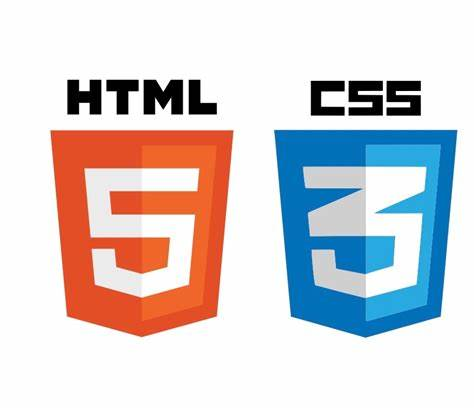

# Intro

## Modul 101 - Webauftritt erstellen und veröffentlichen

<figure><figcaption></figcaption></figure>

## Über dieses Script

Dieses Script wurde für [ICT-Berufsbildung Zentralschweiz](http://www.ict-bz.ch) erstellt. Es dient als Grundlage, um die in der Modulidentifikation von ICT Berufsbildung Schweiz definierten Kompetenzen für das Modul 101 zu erlangen.


[Modulidentifikation](https://www.modulbaukasten.ch/module/101/3/de-DE?title=Webauftritt-erstellen-und-ver%C3%B6ffentlichen)

