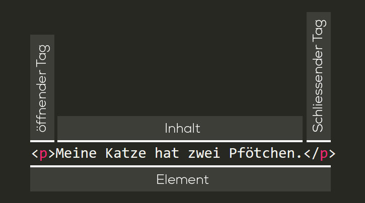
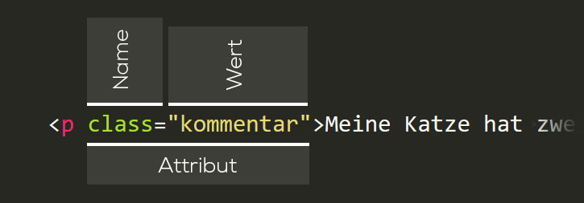

# HTML-Grundlagen
HTML ist keine Programmiersprache, sondern eine Auszeichnungssprache; sie ist dazu gedacht, einer Website Struktur zu verleihen.

Die Sprache besteht aus einer Reihe von Elementen, Tags genannt, welche um verschiedene Teile des Inhalts herum platzieren werden können, um diesem eine spezielle Aufgabe zuzuweisen. Zum Beispiel kann damit einen Text oder ein Bild in einen Link verwandelt werden.

Um die Auszeichnungssprache kennenzulernen, nehmen wir folgenden Inhalt:

```html
Meine Katze hat zwei Pfötchen.
```

Wenn wir möchten, dass der Satz in einem eigenen Absatz steht, können wir mit `<p>` spezifizieren, das es sich um einen Absatz handelt:

```html
<p>Meine Katze hat zwei Pfötchen.</p>
```
## Aufbau eines HTML-Elements
Das oben beschriebene Beispiel zeigt, wie ein HTML-Element aufgebaut ist:



1. **Das öffnende Tag:** Diese besteht aus dem Namen des Elements (in diesem Fall ein p für _paragraph_ (engl.: Absatz)), welcher zwischen zwei spitzen Klammern eingesetzt ist. Dies zeigt an, wo das Element beginnt — in diesem Fall am Anfang unseres Absatzes.
2. **Der Inhalt:** Dies ist der Inhalt des Elements, in diesem Fall einfach nur Text.
3. **Das schliessende Tag:** Dieses sieht genauso aus wie das öffnende Tag, bis auf den zusätzlichen Schrägstrich (Slash) vor dem Namen des Elements. Dieser Tag kommt an das Ende des Elementes — in diesem Fall am Ende des Absatzes.
4. **Das Element:** Das öffnende Tag, der Inhalt und das schliessende Tag gemeinsam ergeben zusammen das Element.

### Attribute
Elemente können auch Attribute enthalten. Das sieht dann so aus:



Attribute enthalten Zusatzinformationen über das Element, welche nicht als eigentlicher Inhalt anzeigt werden. In diesem Fall erlaubt das Attribut, dem Element einen Identifizierungsnamen zu geben. Diesen kann manh später dazu verwenden, das Element mit Informationen wie zum Beispiel Schriftart und -farbe zu versehen.

In unserem Beispiel ist der *Name* des Attributes `class` und `kommentar` ist der diesem Attribut zugeordnete *Wert*.

Ein Attribut sollte immer haben:

1. Einen Abstand zwischen ihm und dem Elementnamen (oder dem vorherigen Attribut, wenn es mehrere sind).
2. Den Attributnamen, gefolgt von Gleichheitszeichen
Anführungs- und Schlusszeichen um den Wert (beispielsweise: "kommentar").

### Verschachtelte Elemente
Mehrere Elemente können ineinander verschachtelt werden. Wenn wir also besonders betonen wollen, dass unsere Katze **zwei** Beine hat, können wir dieses einzelne Wort in einem `<strong>` Element verpacken.

```html
<p>Meine Katze hat <strong>zwei</strong> Pfötchen.</p>
```

Folgendes Beispiel ist **nicht richtig**, da die Elemente nicht ineinander verschachtelt sind, sondern überlappen. Das Element, das zuerst geöffnet wird, muss als letztes geschlossen werden.

```html
<p>Meine Katze hat <strong>zwei Pfötchen.</p></strong>
```

# Leere Elemente
Gewisse Elemente haben keinen Inhalt, diese werden leere Elemente genannt. Beispielsweise das `` Element:

```html

```

Das ``-Tag beinhaltet zwei Attribute, aber es gibt kein schliessendes `</img>`-Tag und keinen Inhalt in dem Element. Das ``-Tag braucht keinen Inhalt um einen Effekt zu haben. Es bindet ein Bild an der entsprechenden Stelle in der HTML-Seite ein.

## Liste mit HTML-Tags
Unter folgendem Link befindet sich eine Liste der HTML-Tags mit Beschreibung und Beispielen:

[Liste von HTML-Tags](https://www.w3schools.com/tags/)

**ACHTUNG:** Elemente mit dem Vermerk `Not supported in HTML5.` sollten nicht mehr verwendet werden.

# Aufgabe
Gehe auf [Codepen.io](https://codepen.io/pen/) und probiere folgende Tags aus:
```html
- <h1> bis <h6>
- <em>
- <a>
- 
```

