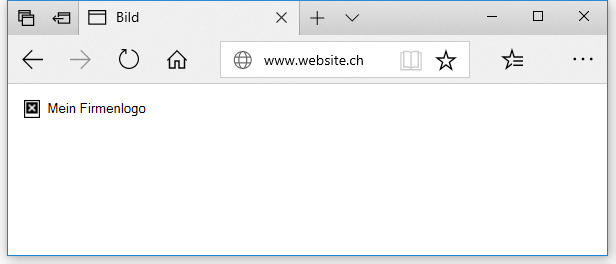

# Spezielle Tags
## Bilder
Das ``-Tag bettet ein Bild an der Stelle der Seite ein, wo es in der HTML-Struktur eingegliedert ist. Es tut dies mit dem `src` ('src' steht für 'source') Attribut, welches den Pfad zum gewünschen Bild beinhaltet.

```html

```

Das genauso wichtige Attribut ist das `alt`-Attribut. Diese Attribut muss immer vorhanden sein. Es darf jedoch explizit leer gelassen werden.

Der Text im `alt`-Attribut wird angezeigt, wenn das Bild nicht geladen werden kann. Dies ist nützlich für Sehbehinderte, für Suchmaschinen (können keine Bilder sehen) und wenn es einen Fehler beim Laden des Bildes gibt. Dieser alternative Satz sollte dem Leser eine Informationen geben, damit er sich vorstellen kann, was auf dem Bild angezeigt ist.

```
```



## Überschriften
Mit Überschriftelementen können bestimmte Teile des Inhaltes als Überschrift deklariert werden. Wie ein Buch einen Hauptitel und Kapitelüberschriften haben kann, können HTML Dokumente eine Hauptüberschrift und weitere Überschriften haben.

HTML besitzt sechs Überschrifttypen, wobei meist nur 3-4 gebraucht werden: `<h1>–<h6>`

```html
<h1>Ich bin eine Hauptüberschrift</h1>
<h2>Ich bin die höchste Unterüberschrift</h2>
<h3>Ich bin eine Unterüberschrift</h3>
<h4>Ich bin eine weitere Unterüberschrift</h4>
```

Um eine logische Dokumentenstruktur zu erhalten, sollten keine Ebenen übersprungen werden (z. B. `h3` gefolgt von `h5`).

## Links
Links sind sehr wichtig. Sie sind, was das Internet zu einem **NETZ/WEB** macht. Um einen Link zu implementieren, müssen wir das `<a>`-Element verwenden. Das `a` ist die Kurzform für "Anker" (engl."anchor"). Um einen Text innerhalb des Absatzes in einen Link zu verwandeln, führen wir folgende Schritte aus:

Zuerst schreiben wir einen Satz.
```html
Heute ist ein schöner Tag in Luzern.
```
Nun wählen wir die Wörter aus, welche wir als Link definieren möchten und umschliessen diesen Bereich mit einem `<a>`-Tag.

```html
Heute ist ein <a>schöner Tag</a> in Luzern.
```
Nun definieren wir mit dem `href`-Attribut, wo der Link hinzeigen soll.

```html
Heute ist ein <a href="https://tourismus-luzern.ch">schöner Tag</a> in Luzern.
```