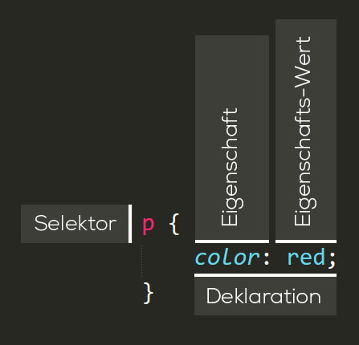

# CSS-Grundlagen
Wie HTML ist auch CSS keine Programmiersprache sondern eine Stylesheet-Sprache.

CSS erlaubt es, für Elemente auf einer Website das Aussehen festzulegen. Zum Beispiel benötigt man folgengen CSS-Code, um alle Absätze (`<p>`) auszuwählen und deren Inhalt rot einzufärben:

```css
p {
  color: red;
}
```

## CSS-Einbinden
Probieren wir es gleich aus: Kopiere diese drei Zeilen CSS in eine neue Datei im Texteditor und speichere die Datei unter dem Namen `style.css` im gleichen Verzeichnis wie deine HTML-Datei `invoice.html` für die Rechnung.

Nun haben wir zwar diese beiden Dateien, diese wissen jedoch noch nichts voneinder. Dies können wir ändern, in dem wir das CSS mit dem HTML-Dokument verknüpfen.

Öffne die Datei `invoice.html` und füge die folgende Zeile irgenwo in den `<head>`-Bereich ein:

```html
<link href="style.css" rel="stylesheet">
```

**`<link>`** - Mit dem `<link>` kann das HTML-Dokument mit anderen Dokumenten verlinkt werden - es entsteht eine Beziehung (Link) zum angegebenen Dokument.

**`rel`** -  Das `rel`-Attribut bestimmt den Typ der Beziehung. Dieses Attribut bestimmt die Art einer Beziehung (rel = relation = Bezug). Hierfür ist eine Reihe von [Attributwerten](https://www.w3.org/TR/html5/links.html#linkTypes) fest definiert.

**`href`** - Das `href`-Attribut zeigt das Ziel der Beziehung. Das `href`-Attribut (href = hyper reference = Hyper(text)
-Referenz) gibt somit an, welches andere Dokument in Bezug zum aktuellen steht. Als Wert wird ein gültiger URI erwartet.

Die angegebene URI kann dabei relativ oder absolute definiert werden - dazu ein kleiner [Exkurs](src/relativ-absolut.pdf).

Betrachte anschliessend die Datei `invoice.html` im Browser - die Absätze sollten nun rot eingefärbt sein.

#### Relative Pfade
Relative Pfaden haben das aktuelle Dokument als Ausgangspunkt für den angegebenen Pfad.

Beispiel für relativer Pfad:

```html
<link href="../../css/frontpage/style.css" rel="stylesheet">
```

`../` - Zwei Punkte und ein Frontslash vermitteln dem Interpretator des Pfades, dass dieser den aktuellen Ordner verlassen und in die nächst höhere Ebene gehen soll.

```txt
root/
    html/
       pages/
         |-> index.html
    css/
       frontpage/
         |-> style.css
```

Beziehungen von internen Dateien werden meistens mit einem relativen Pfad angegeben. So können die Dateien problemlos verschoben werden (beispielsweise von der Entwicklungsumgebung auf den Produktivserver).

#### Absolute Pfade
Absolute Pfade haben immer das Stammverzeichnis eines Servers (Root) als Ausgangspunkt für den angegebenen Pfad. 

Beispiel für absoluter Pfad für die gleiche Ordnersturktur wie oben:

```html
<link href="root/css/frontpage/style.css" rel="stylesheet">
```

Werden Beziehungen zu externen Dateien (Frameworks, Schriften etc.) hergestellt, wird der Pfad meistens mit einem absoluten Pfad angegeben. Dabei sollte der Anbieter sicherstellen, dass sich der Pfad nicht ändert.


## Aufbau einer CSS-Regel
Die ganze Struktur wird Regelsatz (oder oft nur Regel) genannt:



### Bestandteile

**Selektor** - Der HTML-Elementname steht direkt am Anfang der Regel. Er wählt die Elemente, die gestaltet werden sollen (in diesem Beispiel `p`) aus. Um ein anderes Element zu gestalten, muss nur der Selektor geändern werden.

**Deklaration** - Eine einzelne Regel wie `color: red;` gibt an, welche Eigenschaft des Elements gestaltet werden soll. Eine Deklaration besteht aus einer Eigenschaft (`color`) und einem Eigenschafts-Wert (`red`).

**Eigenschaft (englisch: property)** - Art wie das ausgewählte HTML-Element gestaltet werden soll. In diesem Fall ist `color` eine Eigenschaft des `<p>` Elements.

**Eigenschafts-Wert (englisch: property value)** - Rechts neben der Eigenschaft, nach dem Doppelpunk, steht der Wert der Eigenschaft. Dieser gibt eine von vielen Möglichkeiten wieder, wie die Eigenschaft das Aussehen eines Elements verändern kann.

### Syntax
* Hinter dem Selektor stehen die zugehörigen Regeln innerhalb geschwungener Klammern (`{}`).
* Innerhalb einer Deklaration muss man einen Doppelpunkt (`:`) nutzen, um Eigenschaft und Wert zu trennen.
* Am Ende jeder Deklaration muss ein Semikolon (;) gesetzt werden. Dieser trennt mehrere Deklarationen voneinander ab.
```css
p {
  color: red;
  width: 500px;
  border: 1px solid black;
}
```

### Mehrere Elemente auswählen
Teilen sich mehrere Elemente die gleichen Regeln, können diese miteinander selektiert werden. Dazu werden einfach mehrere Selektoren hintereinander geschrieben, getrennt durch Kommas:

```css
p, li, h1 {
  color: red;
}
```

### Verschiedene Arten von Selektoren


#### Element-Selektor 
Auch Tag- oder Typ-Selektor genannt. Alle HTML-Elemente eines bestimmten Typs werden ausgewählt.

```css
p {
    color: red;
}
```

```html
<p>Wird ausgewählt</p>
<p>Wird auch ausgewählt</p>

<div>Wird nicht ausgewählt</div>
```

#### ID-Selektor

Elemente mit der entsprechenden ID werden ausgewählt. Eine ID kann immer nur einem einzigen Element innerhalb eines Dokuments zugeordnet werden.

```css
#important {
    color: red;
}
```

```html
<p id="important">Wird ausgewählt</p>

<p>Wird nicht ausgewählt</p>
```

#### Klassen-Selektor

Elemente mit der entprechenden Klasse werden ausgewählt. Klassen können mehreren Elementen innerhalb eines Dokuments zugeordnet werden.


```css
.important {
    color: red;
}
```

```html
<p class="important">Wird ausgewählt</p>
<p class="important">Wird auch ausgewählt</p>

<p>Wird nicht ausgewählt</p>
```

#### Attribut-Selektor

Elemente mit entsprechendem Attribut werden ausgewählt.

```css
p[data-topic="css"] {
    color: red;
}
```

```html
<p data-topic="css">Wird ausgewählt</p>

<p data-topic="html">Wird nicht ausgewählt</p>
```

#### Pseudoklassen-Selektor

Elemente eines bestimmten Typs, welche sich in einem bestimmten Zustand befinden, werden ausgewählt. (z. B. Mauszeiger ist über dem Element = `hover`)

```css
a {
    color: blue;
}
a:hover {
    color: red;
}
```

```html
<a href="css.html">Wird rot wenn der Mauszeiger darüber fährt.</a>
```
