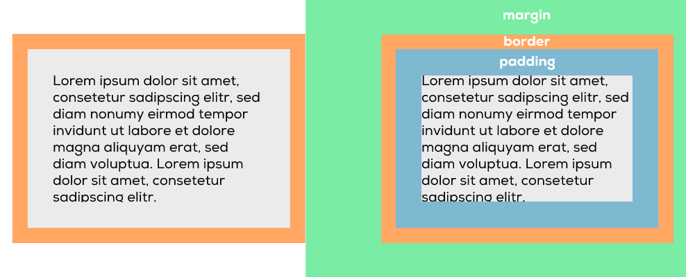

# CSS-Boxmodell
Wie dir bei HTML- und CSS-Code vielleicht bereits aufgefallen ist, geht es oft darum Boxen zu erstellen (HTML) und Boxen zu gestalten (CSS). Die meisten HTML-Elemente sind somit Boxen oder Schachteln, welche übereinander gestapelt wurden.

CSS ist nun dafür da, deren Grösse, Farben, Position usw. zu bestimmen.

Das CSS-Layout basiert auf dem Box-Modell. Jede Box, die Platz auf einer Webseite einnimmt, hat folgende Eigenschaften:

### Innenabstand (padding)

Das Padding ist der Raum zwischen Inhalt und Rahmen eines Elements.

### Rahmen (border)

Der Border ist der Rahmen um ein Element.

### Aussenabstand (margin)

Der Abstand vom Border bis zum nächsten benachbarten Element.

