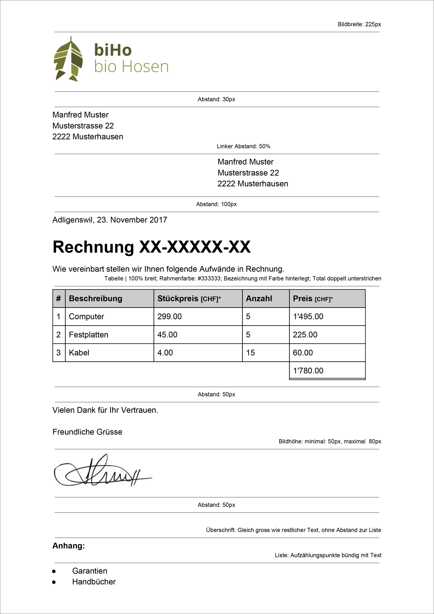

# Rechnung gestalten

## Aufgabenstellung
1. Verknüpfe das externe Paper-Framework mit deiner `invoice.html`. 

    ```text
    https://offline.swiss/vfi/paper.css
    ```
2.  Style die erstelle `invoice.html` mit Hilfe deiner eigenen CSS-Datei. Das Ergebnis soll dabei möglichst ähnlich aussehen, wie die Rechnungsvorlage unten.
3. Kopiere den Code anschliessend in den CSS-Validator und korrigiere allfällige Fehler.

## Rechnungsvorlage
Allgemeine Styles:
* Schriftart: Arial
* Zeilenhöhe: 1.5

Die anderen Styles sind aus dem Dokument herauszulesen:



Hier findest Du die Rechnung noch als [PDF](src/Rechnungsvorlage.pdf).