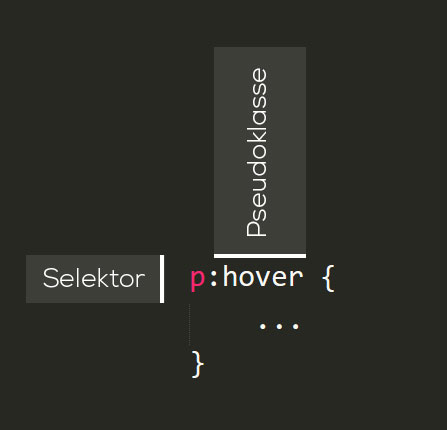
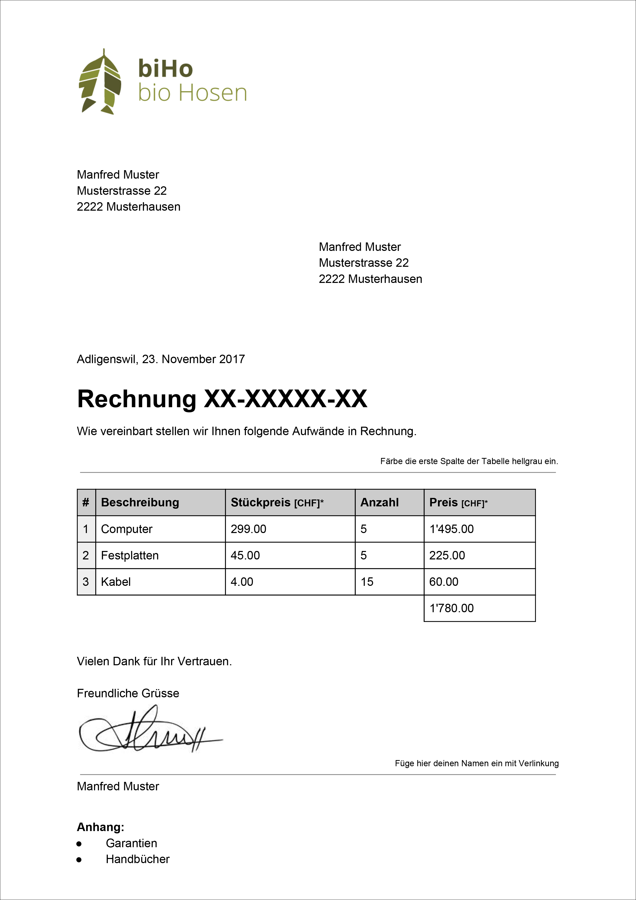

# Pseudoklasse
Eine CSS Pseudoklasse ist ein Schlüsselbegriff, welcher hinter einen Selektor gestellt wird, um einen spezifischen Zustand abzufragen. So steht beispielsweise `:hover` für Elemente, welche gerade mit dem Mauszeiger berührt werden.

Mit Pseudoklassen lässt sich eine Seite nicht nur in Bezug auf die Struktur des Inhalts gestalten, sondern auch im Bezug auf andere Faktoren wie zum Beispiel dem Browserverlauf  (`:visited`), Reihenfolge der Elemente (`:first-child`) oder die Position des Mauszeigers (`:hover`).

Die Pseudoklasse wird angeführt mit einem Doppelpunkt und hinter den regulären Selektor angefügt.

## Links
Vorallem bei Links (`<a>`) sind die Pseudoklassen wichtig, um den Website-Besucher mitzuteilen, dass es sich hier beispielswiese um klickbare Elemente handelt.

| Pseudoklasse | Ausgewählte Elemente                                                                                                                                                  |
|--------------|-----------------------------------------------------------------------------------------------------------------------------------------------------------------------|
| `a:link`       | Dies wählt jeden Link aus, der bisher noch nicht besucht wurde.                                                                                                       |
| `a:visited`  | Dies wählt jeden Link aus, der bereits besucht wurde.                                                                                                                |
| `a:hover`      | Dies wählt einen Link aus über dem sich der Mauszeiger gerade befindet.                       |
| `a:active`     | Dies wählt jedes Element aus, welches vom Benutzer momentan angelickt wird. |

## Sonstige nützliche Pseudoklassen
| Pseudoklasse | Ausgewählte Elemente                                                                                                                                         |
|--------------|--------------------------------------------------------------------------------------------------------------------------------------------------------------|
| `:first-child` | Dies wählt jedes Element aus, welches das erste Kindelement seines   Elternelements ist.                                                                     |
| `:last-child`  | Dies wählt jedes Element aus, welches das letzte Kindelement seines   Elternelement ist.                                                                     |
| `:nth-child()` | In der Klammer dieser Pseudoklasse muss noch ein Wert mitgegeben werden -   Beispiel: 2n. So wird jedes 2te Kindelement seines Elternelements   ausgewählt. |

## Aufgabe
1. Füge nach der Unterschrift deinen Namen hinzu. Verlinke den Namen mit einem Social-Media-Profil (Facebook, Instagram, Twitter, XING, LinkedIn) von dir und style jeden möglichen Zustand des Links mit den entsprechenden CSS-Pseudoklassen.
1. Färbe die erste Spalte der Tabelle mit Hilfe einer Pseudoklasse hellgrau ein. Achte dabei darauf, dass die letzte Reihe mit dem Total keinen Hintergrund erhält.

Hier findest Du die Rechnung noch als [PDF](src/Rechnungsvorlage.pdf).