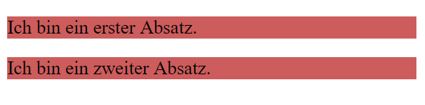
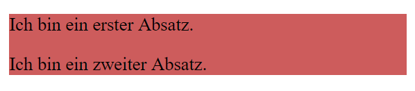

# Dokumentenstruktur
Um Elemente innerhalb eines Dokuments besser zu strukturieren, hat HTML eigens dafür ein Strukturelement vorgesehen: das `<div>`. Das `<div>`-Element (Document Division Element) ist ein generischer Container für Inhalte, der im Grunde genommen Nichts repräsentiert. Das Element kann für die Gruppierung von Elementen genutzt werden, um sie zu stylen (mit Hilfe des `class` oder `id` Attributs). 

Beispiel: Wir möchten das die folgenden Absätze mit einer Hintergrundfarbe hinterlegt sind, ohne einen weissen Absand dazwischen zu haben.

```html
<p>Ich bin ein erster Absatz.</p>
<p>Ich bin ein zweiter Absatz.</p>
```

```css
p {
    background-color: indianred;
}
```

Dies entspricht jedoch nicht unserem gewünschten Ergebnis:



Um das Ziel zu erreichen, umklammern wir die beiden Absätze mit einem `<div>`-Strukturelement und stylen das `<div>`-Element:

```html
<div class="red">
    <p>Ich bin ein erster Absatz.</p>
    <p>Ich bin ein zweiter Absatz.</p>
</div>
```

```css
.red {
    background-color: indianred;
}
```



### Aufgabe
Schreibe das HTML & CSS deines Briefes so um, dass kein `margin` oder `padding` mehr einem `<p>`, `` oder `<table>`-Tag zugewiesen ist.

## Semantische Elemente
Semtantische Elemente sind gleichbedeutend wie `<div>`-Strukturelemente, sie haben aber einem vordefinierten Anwendungszweck.

So sollte das `<header>`-Element ausschliesslich für die Strukturierung des Kopfbereichs von Sektionen und Websites verwendet werden.

| Semantisches   Element | Beschreibung                                                                                        | Möglicher Inhalt           |
|------------------------|-----------------------------------------------------------------------------------------------------|----------------------------|
| `<header>`               | Das Element beinhaltet Kopfelemente der Website oder einer Sektion.                                                    | Navigation, Logo, Suchfeld |
| `<nav>`                  | Das Element beinhaltet eine Navigation.                                                  | Navigation                 |
| `<main>`                 | Das Element beinhaltet den Hauptinhalt der Website.                                                 | Hauptinhalt                |
| `<section>`                | Das Element unterteilt ein Dokument in mehrere allgemeine Sektionen. | Lead                    |
| `<aside>`                | Das Element beinhaltet Informationen, welche mit dem Hauptinhalt der   Website in Verbindung stehen. | Sidebar                    |
| `<footer>`               | Das Element beinhaltet Fusselemente der Website oder einer Sektion.                                                    | Copyright, nützliche Links |


Die semantischen Elemente erleichtern vorallem die Human-Readability des HTML- und CSS-Codes.

**Darum gilt:** Generische `<div>`-Elemente sollten nur genutzt werden, wenn kein semantisches Element geeignet ist.

## Aufgabe
Unterteile deinen Brief mit den entsprechenden semantischen Elementen in einen Kopf-, Haupt- und Fussbereich.