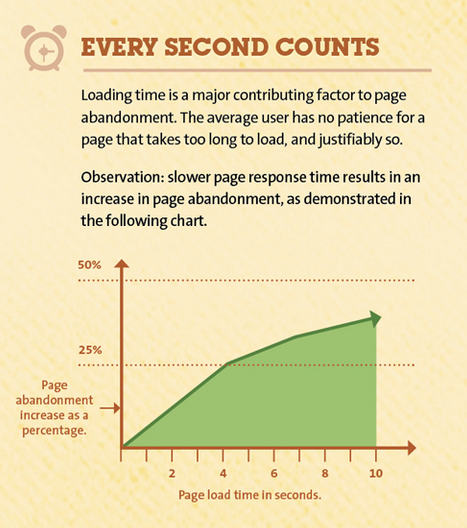
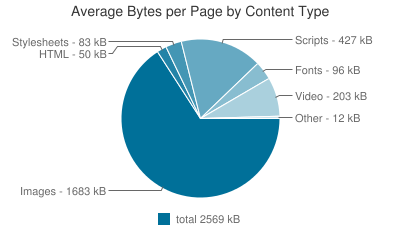
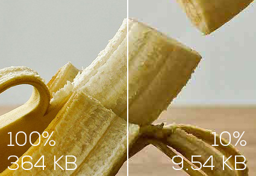
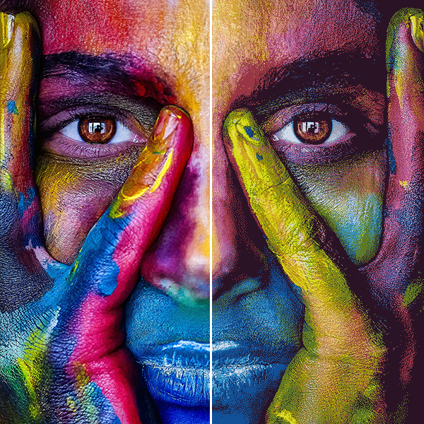

# Ladegeschwindigkeit
Die zentrale Rolle der Ladegeschwindigkeit für eine Website zeigt folgendes Beispiel:

* Nach mehr als zwei Sekunden Ladezeit erhöht sich die Absprungrate (Personen, welche die Website verlassen) um 12%.
* Nach mehr als vier Sekunden Ladezeit erhöht sich die Absprungrate um 25%.

Der Grund für lange Ladezeiten sind häufig schlecht verarbeitete Medien (Bilder, Videos). Durchschnittlich machen Bilder mehr als **65% des Inhaltes** einer Website aus.

## Geschwindigkeitstests
Um die Geschwindigkeit einer Website zu testen gibt es unterschiedliche Tools. Hier zwei davon: 

* [Google-PageSpeed-Test](https://developers.google.com/speed/pagespeed/insights/)
* [WebPagetest](http://www.webpagetest.org/video/)

# Bild-Formate

## JPEG
JPEG oder JPG ist ein verlustreiches Bildformat von der Joint Photographic Experts Group.

* Das JPG-Format verfügt über mehr mehrere Millionen Farben. Dies macht es zur idealen Wahl für die Anzeige von Fotografien im Web.
* JPEG ist en verlustreiches Bildformat. Die Kompression kann also dazu benutzt werden um die Dateigrösse zu reduzieren: Die Qualität bei einer Kompression von 60% ist meistens absolut ausreichend für das Web. Bei einem Kompressionsfaktor grösser als 75% kann es zu deutlichen Qualitätsverlusten kommen.
    
    

* JPG-Bilder unterstützen keine Transparenz. Sollte ein Teil des Bildes somit transparent sein, eignet sich das JPG-Format nicht.

### Anwendungsfall

Verwende JPEG für Fotos.

## GIF

GIF steht für Graphics Interchange Format.

* Das GIF-Format verfügt nur über 256 Farben, dadurch ist die Dateigrösse meistens entsprechend klein.
    
* Das GIF-Format ist ein verlustfreies Bildformat.
* Das GIF-Format unterstützt Transparenz - dabei gibt es jedoch keine Halbtransparenz (z. B. 50% weiss), sondern immer nur ganz oder garnicht.
* Das GIF-Format unterstützt Animationen - darum kann es gut eingesetzt werden für repetierende, animierte Bilder wie Icons, Emoticons, Banner etc.
* Eignet sich für einfache Grafiken mit wenig Farben, jedoch nicht für Fotografien.

### Anwendungsfall

Verwende GIFs für Animationen oder Bilder, die wenige Farben enthalten und als GIF eine kleinere Dateigrösse aufweisen als als PNG.

## PNG
PNG steht für Portable Network Graphics. Es ist eine alternative zum GIF-Format, welches vom W3C-Konsortium entwickelt wurde. 

* Wie das JPEG, verfügt das PNG über Millionen von Farben.
* Wie das GIF, handelt es sich um einen verlustfreien Kompressionsalgorithmus.
* Das PNG-Format unterstützt Transparenz - dabei gibt es die Möglichkeit für teiltransparente Pixel (75% - transparent; 25% - weiss). Es eignet sich deshalb für Bilder mit unterschiedlichen Transparenzstufen.
* Es eignet sich daher sich für komplexe Bilder und Grafiken.

### Anwendungsfall

Verwende PNGs nie für Fotos sondern nur für Illustrationen oder Icons. PNGs komprimieren Bilder mit grossen einfarbigen Flächen besonders gut.

## SVG
SVG steht für Scalable Vector Graphics und ist eine XML-basiertes Vektordatei. Obwohl es bereits 2001 entwickelt wurde, wurde das Format erst in den letzten Jahren populär für den Einsatz im Web. Der Grund dafür lag in der schwachen Unterstützung der Webbrowsern für dieses Format. In der Zwischenzeit wird das SVG-Format von den meisten Browsern unterstützt - leider immer noch mit einigen Bugs.

* Das SVG-Format ist weniger ein Bild aus Pixeln, als eine Bauanleitung für Vektoren um daraus ein Bild oder eine Grafik zu bauen. Es eignet sich deshalb vorallem für Grafiken wie Logos, Karten, Icons etc.
* Da es sich um ein Vektor-Format handelt, können die Bilder beliebig und ohne Qualitätseinbussen skaliert werden.
* SVG-Bilder unterstützen Animationen und können via CSS oder JavaScript animiert werden.
* Bei komplexeren Bildern steigt die Dateigrösse von SVG-Bilder rasant an. Darum eignet sich das Format mehr für Grafiken, als für Fotografien.

### Anwendungsfall

Verwende SVGs dann, wenn ein Bild in verschiedenen Grössen benötigt wird oder eine geringere Dateigrösse als bei PNGs oder GIFs erreicht werden kann. Achte bei der Verwendung im Web auf den Browser-Support.

## WebP (Vorschau)
Dieses Bildformat hat jedoch Web in seiner DNA: Es wurde für den Gebrauch im Internet (von Google) entwickelt.

> WebP is a modern **image format** that provides superior **lossless and lossy** compression for images on the web. … WebP lossless images are 26% smaller in size compared to PNGs. WebP lossy images are 25-34% smaller than comparable JPEG images … Lossless WebP supports **transparency** … at a cost of just 22% additional bytes. For cases when lossy RGB compression is acceptable, **lossy WebP also supports transparency**, typically providing 3× smaller file sizes compared to PNG.
-- [WebP Website](https://developers.google.com/speed/webp/)

Der Vorteil von WebP ist also, dass es die Vorzüge von JPG und PNG in einem Bildformat kombiniert - ohne dabei auf eine überdimensionale Dateigrösse zu wachsen.

**ACHTUNG:** Leider ist der Browsersupport für das Format noch nicht flächendeckend gewährleistet. Aus diesem Grund sollte im Moment noch auf den Einsatz verzichtet werden. Sollten jedoch Firefox, IE/Edge und Safari auf den Zug aufspringen, hat dieses Bildformat ein grosses Potential.

# Einsatz von Bildern

Wichtig ist es nicht nur die Bilder im richtigen Bildformat bereitzustellen, sondern auch in einer angemessenen Grösse. Bilder sollten immer in der Grösse bereitgestellt werden, in der sie tatsächlich im Web verwendet werden.

Hier noch ein nützliches Werkzeug um mehrere Fotos miteinander zu verarbeiten: [Bulk Resize Photos](https://bulkresizephotos.com/).

# Rechte an Bildern & Inhalten

> Alle Inhalte im Internet sind grundsätzlich urheberrechtlich geschützt und dürfen nicht öffentlich verbreitet werden. Das gilt für Musik, die zwar frei aus dem Web kopiert, aber nur im privaten Kreis ab­gespielt und weitergegeben werden darf, ebenso wie für Fotos: Als Desktop-Hintergrund, Schlafzimmerposter oder Illustra­tion in einer E-Mail an Freunde darf man jedes Bild verwenden. Auf einer öffentlich zugänglichen Homepage aber eben nicht.

-- [Beobachter Konsum](https://www.beobachter.ch/konsum/webdesign-die-sache-mit-dem-copyright)

Somit sollten ein Website-Betreiber immer die nötigen Rechte für Bilder haben, welche auf seiner Website gezeigt werden. Mögliche Plattformen für den Erwerb von Bild-Lizenzen:

- [Fotolia](https://de.fotolia.com/)
- [Shutterstock](https://www.shutterstock.com)

Daneben gibt es auch noch komplett kostenlose Bildportale. Meistens sind die Aufnahmen von Amateur- und Hobbyfotografen, die aber deshalb nicht schlechter sein müssen:

- [Pixabay](https://pixabay.com/de/)
- [Pixelio](https://www.pixelio.de/)