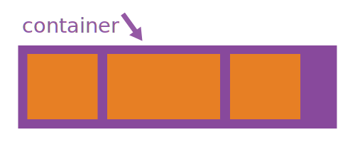

# Flexbox
Das Flexbox-Layout-Modul (flexible Boxen) zielt darauf ab das Layouten, Ausrichten und Ausnutzen des Platzes innerhalb einzelner Elemente in einem Container zu vereinfachen. Dies vorallem unter der Prämisse, dass die Grösse der Elemente unbekannt und/oder dynamisch ist (darum das Wort "flex").

Die Grundidee hinter dem flexiblen Layout ist es dem Container die Möglichkeit zu geben, seinen Inhalt zu steuern (Höhe, Breite, Reihenfolge), dass der verfügbare Platz möglichst gut ausgenutzt werden kann (meistens in Anbetracht der verschiedenen Anzeigegeräten und den damit verbunenen Unterschieden der Anzeigegrössen). Der Flex-Container kann somit Elemente vergrössern, verkleinern und umsortierten um den vorhandenen Platz möglichst optimal auszunutzen.

Das Wichtigste: Ein Flexbox-Layout ist richtungsunabhängig, ganz im Gegensatz zu regulären Layouts (`block` ist vertikal; `inline` ist horizontal). Die reguläre Methode funktioniert zwar gut bei simplen Anordnungen von Element, stösst jedoch bei komplexeren Konstrukten an ihre Grenzen (vor allem wenn es zu Änderungen kommt: Richtungsänderungen, Grössenänderungen etc.).

**Aber Achtung:** Flexbox-Layouts wurden nicht dafür konzipiert ganze Layouts zu gestalten, sondern nur für einzelne Komponenten auf einer Website. Für die Seitenlayouts wurde das CSS-Grid-Modul vorgesehen (später dazu mehr).

# Grundlagen und Begriffe
Flexbox ist nicht einfach eine einzlene CSS-Regel, sondern ein ganzes Modul. Das Modul beinhaltet somit nicht nur eine Eigenschaft, sondern ein ganzes Set aus zusammengehörigen CSS-Regeln. Manche Regeln sind dafür da, den Flex-Container zu konfigurieren (das Elternelement, wird als "flex container" bezeichnet), andere wiederum sind für die im Container enthaltenen Kindelemente (genannt "flex-items").

Während dem "normale" Layouts auf den Anordnungsrichtungen `block` (vertikal) und `inline` (horizontal) basieren, basiert das Flex-Layout auf den Flex-Richtungen (engl. flex-flow-directions). Die folgende Grafik zeigt die wichtigsten Begriffe des Flex-Layouts:

Grundsätzlich werden die Flex-Items entweder entlang der `main axis` (vom `main-start` zum `main-end`) oder entlang der `cross axis` (vom `cross-start` zum `cross-end`) gegliedert.