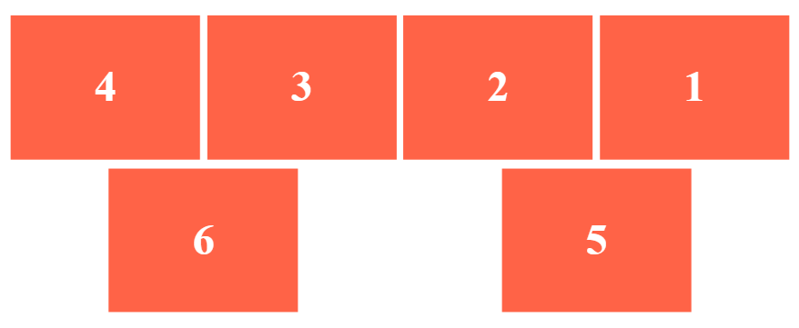
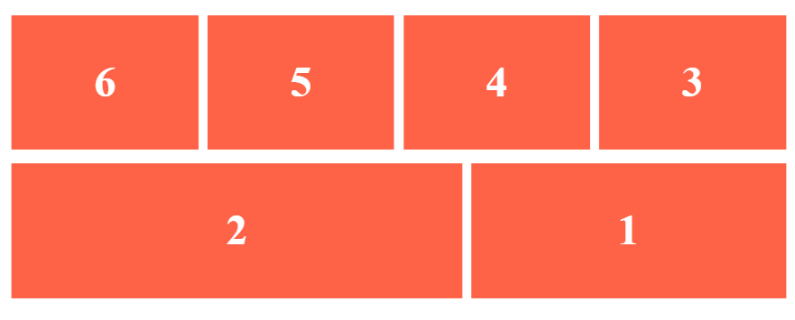

# Aufgabe 1
Lade die Dateien `index.html` und `style.css` bei dir lokal herunter. Ergänze den Flex-Container mit den nötigen CSS-Deklarationen (an der Stelle mit dem Vermerk `Aufgabe 1`), damit das Ergebnis bei den aufgeführten Bildschirmbreiten so aussieht:

#### Bildschirmbreite: 1300px

#### Bildschirmbreite: 800px

# Aufgabe 2
Ergänze die Flex-Items mit den nötigen CSS-Deklarationen (an der Stelle mit dem Vermerk `Aufgabe 2`), damit das Ergebnis bei den aufgeführten Bildschirmbreiten so aussieht:

#### Bildschirmbreite: 1300px

#### Bildschirmbreite: 800px
