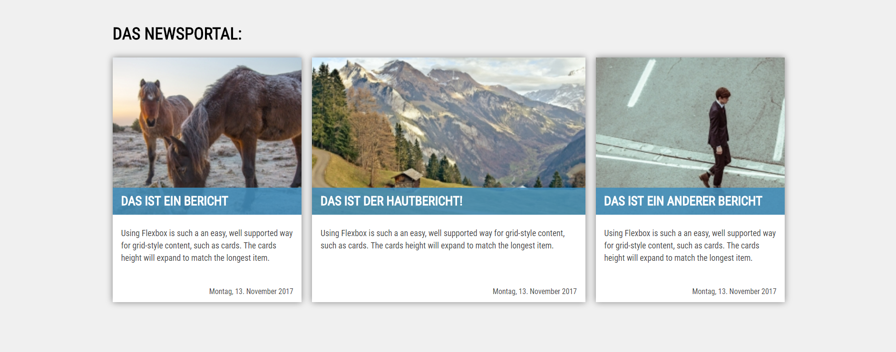
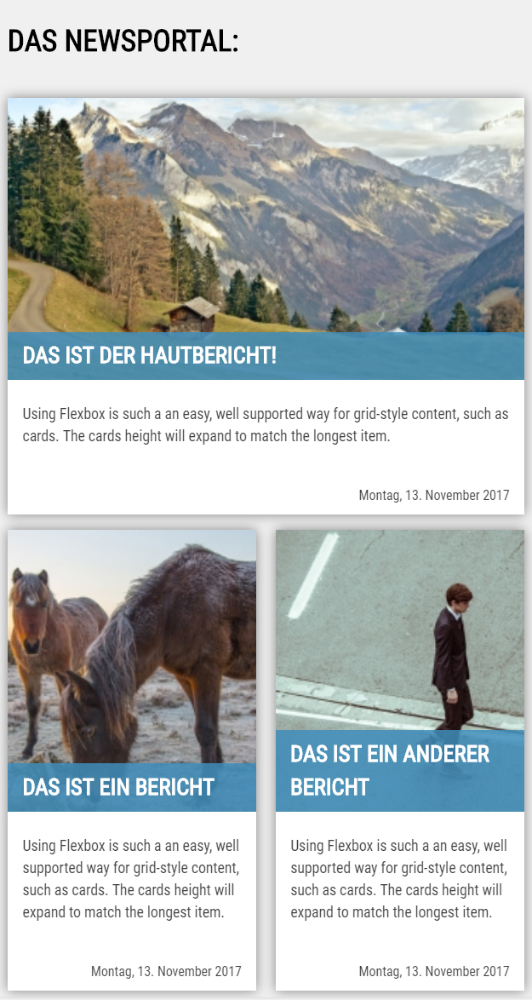

# Aufgabe 1
Lade die HTML- und CSS-Dateien `index.html`, `style.css` und `flex.css` herunter. Ergänze die Datei `flex.css` nun mit den nötigen CSS-Regeln, damit folgendes Layout angezeigt wird:

#### Bildschirmbreite: 1300px


Dabei dürfen die anderen Dateien `index.html` und `style.css` **nicht verändert werden**.

# Aufgabe 2
Die CSS-Regeln innerhalb der geschweiften Klammern der folgenden `@media`-Eigenschaft werden nur interpretiert, wenn die Breite des Bildschirms kleiner als 768px ist - sprich auf Tablets und Handies

```css
@media screen and (max-width: 768px) {
    /* Wird nur interpretiert, wenn der 
    Bildschirm weniger breit als 768px ist. */
}
```

Ergänze nun CSS-Regeln in den geschweiften Klammern, damit das Layout wie folgt auf dem Tablet angezeigt wird, ohne dass sich die Anzeige auf grösseren Bildschirmen ändert:

#### Bildschirmbreite: kleiner als 768px


# Aufgabe 3
Die CSS-Regeln innerhalb der geschweiften Klammern der folgenden `@media`-Eigenschaft werden nur interpretiert, wenn die Breite des Bildschirms kleiner als 480px ist - sprich auf Handies

```css
@media screen and (max-width: 480px) {
    /* Wird nur interpretiert, wenn der 
    Bildschirm weniger breit als 480px ist. */
}
```

Ergänze nun CSS-Regeln in den geschweiften Klammern, damit das Layout wie folgt auf dem Handies angezeigt wird, ohne dass sich die Anzeige auf grösseren Bildschirmen ändert:

#### Bildschirmbreite: kleiner als 480px


