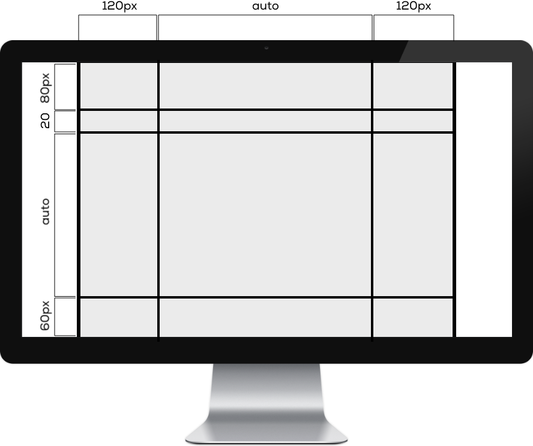
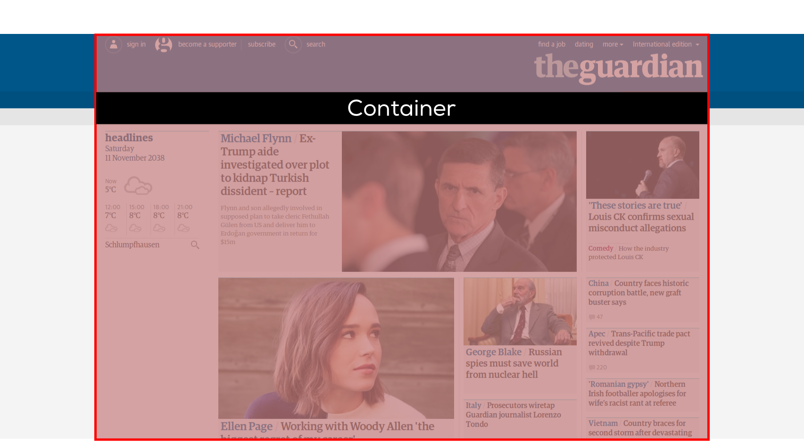
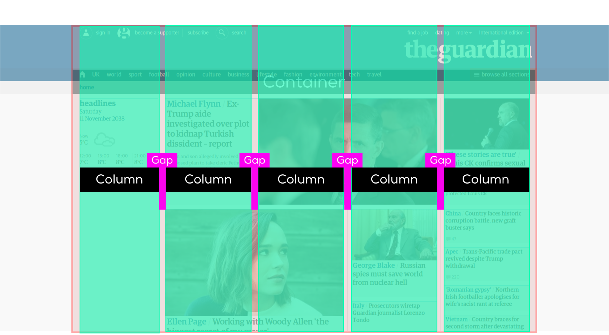
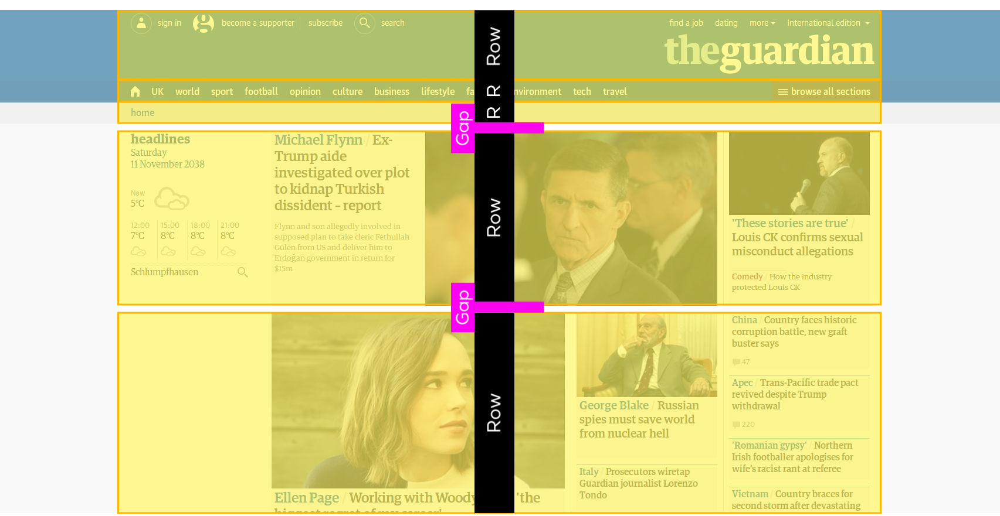
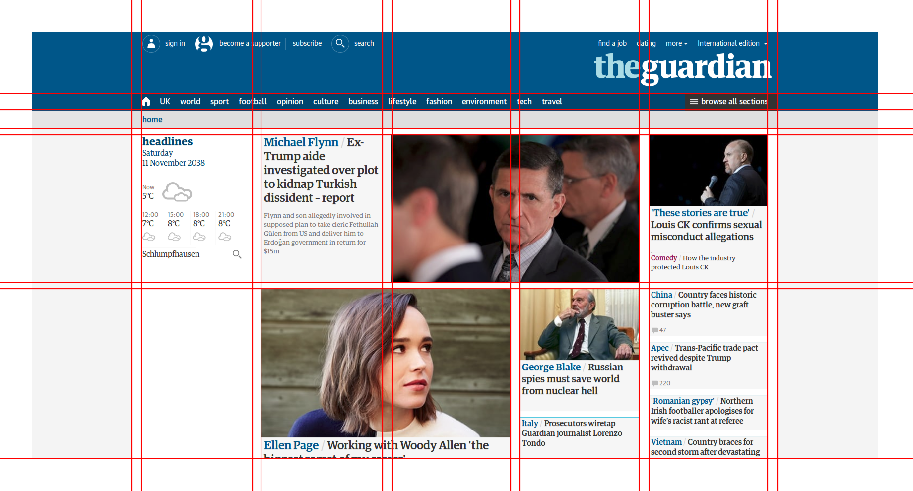

# CSS Grids

Das `CSS Grid Layout` Modul ist die neuste Erweiterung der CSS Spezifikation um das Definieren von gridbasierten Layouts zu vereinfachen. 

Auch wenn das Modul aktuell noch im Entwurfs-Status ist (Stand November 2017), kann es in allen gängigen Browsern mittlerweile verwendet werden:

* [Browser-Support auf caniuse.com](https://caniuse.com/#feat=css-grid)
* [CSS Grid Layout Module Level 1 Editor's Draft](https://drafts.csswg.org/css-grid/)

## Layouts in CSS

Die Methoden zur Definition von Layouts in CSS haben in den letzten Jahren einen stetigen Wandel durchlebt. Dabei wurden folgende Varianten verwendet:

* Tabellen
* CSS-Floats
* Flexbox und CSS Grids

Abhängig des Alters eines Projekts wirst du eine der drei Varianten vorfinden. 
Wir konzentrieren uns in diesem ÜK auf die modernste Methode mit CSS Grids und Flexbox.

## Was ist ein Grid?

Das Grid ist ein Raster, an dem sich alle Elemente in einem Layout ausrichten. 

### Container

Grundlage für jedes Grid ist der `Container`.

Der Container fixiert die Breite des Layouts. Die Höhe kann ebenfalls fixiert werden, wird aber üblicherweise flexibel gelassen. So passt sich die Höhe des Containers automatisch an die Höhe des Inhalts an.

### Columns and Rows

Im Container werden dann beliebig viele Spalten (engl. `Columns`) und Zeilen (engl. `Rows`) definiert. Alle Inhaltselemente richten sich an diesem Raster aus.

### Gaps

Zwischenräume zwischen `Columns` und `Rows` bezeichnet man als `Gaps`.

## Beispiel: theguardian.com

### Container

### Columns

### Rows

### Grid

