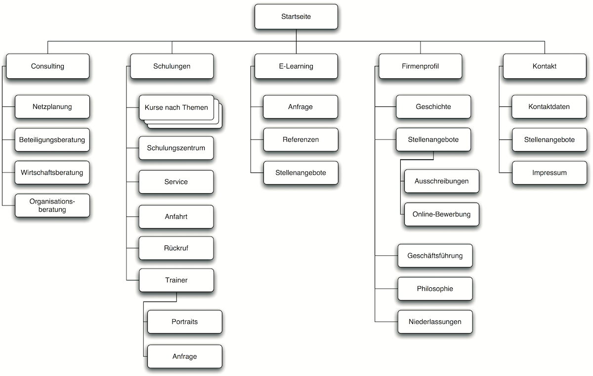

# Konzeptionierung
Ein Auftrag beginnt meistens nie mit der Realisation, sondern immer zuerst mit einem Konzept: Das Konzept beinhaltet die Analyse der IST-Situation, die Festlegung einer stategischen Stossrichtung, die Prüfung von möglichen Lösungsvarianten, die Planung des Vorgehens sowie Kriterien für die Kontrolle der Arbeit.

Natürlich führen viele Wege nach Rom. Der Dertaillierungsgrad des Konzeptes ist meistens abhängig von der Grösse und der Komplexität des Projektes. Im Folgenden werden einige Hilfsmittel und Konzepte vorgestellt, wie man ein Website-Konzept erstellen könnte - die Liste ist jedoch nicht als vollständig und abschliessend zu betrachten.

## Analyse der Ist-Situation: Wettbewerbsanalyse
Eine Website ist nur dann erfolgreich, wenn sie den gewünschten Nutzen für die Zielgruppe und das Unternehmen bringt. Dafür ist es wichtig, dass wir uns von der Konkurrenz abheben können. Eine Analyse der Anderen hilft uns somit bei der eigenen Positionierung. Ein Alleinstellungsmerkmal, das die eigenen Dienste von anderen unterscheidet, ist der Aufhänger um in Zukunft Orientierung zu stiften.

Eine Wettbewerbsanalyse soll folgende Fragen beantwortet:
* Gibt es viel Konkurrenz?
* Wie positionieren sich andere Wettbewerber online? 
* Was kommunizieren sie und wie sprechen sie ihre Zielgruppen an? 
* Wie sieht das Design oder Redesign aus? 
* Welche Inhalte werden vom Wettbewerber präsentiert?

## Festlegung einer Strategie
Der Erfolg einer Website bedeutet, Ziele zu erreichen. Diese Ziele müssen erstmal definiert werden.

Die Festlegung der Stategie sollte somit folgende Fragen beantworten:
* Welche Ziele wollen wir mit der Website erreichen?
* Welche Zielgruppen wollen wir mit der Website ansprechen? Warum?

### Zieldefinition
Viele Unternehmen neigen dazu, den eigentlichen «Webauftritt» als Ziel zu haben. Dieses Ziel sollte mit dem nötigen Budget erreichbar sein. Doch geht es deutlich um mehr - in die Definition von «guten Zielen», sollte daher immer genügen Zeit investiert werden:

| Bereich    | Mögliche Ziele / Beispiele                                                                                                                    |
|------------|-----------------------------------------------------------------------------------------------------------------------------------------------|
| Marketing  | Mehr Besucher-Verkehr, Bedürfnisse wecken,   Leads generieren & reaktivierung bestehender Kunden                                              |
|            | Beispiel: Sechs Monate nach dem Relaunch der neuen Webseite sollen   täglich 35 Besucher Ihre Website besuchen.                               |
|            |                                                                                                                                               |
| Verkauf    | Mehr Verkäufe, höherer Umwandlungssatz von Interessenten zu Käufern &   bessere Verkaufsuntersützung                                          |
|            | Beispiel: Innerhalb der nächsten drei Jahre nach dem Launch sollen täglich   mindestens 1000 Franken Umsatz über den Webshop generiert werden. |
|            |                                                                                                                                               |
| Support    | Verbesserung des Kundensupports & Verringerung der Telefonanfragen                                                                            |
|            | Beispiel: Innerhalb von drei Monaten nach dem Relaunch sollen täglich   zwei Personen weniger die Hotline anrufen.                            |
|            |                                                                                                                                               |
| Webmaster  | Vereinfacht die Verwaltung bestehender und die Veröffentlichung neuer   Inhalte auf der Website                                               |
|            | Beispiel: Mit der neuen Website gibt es innerhalb des nächsten Jahres   halb so viele Support-Anfragen an die Webagentur.                     |
|            |                                                                                                                                               |
| IT         | Integration von Drittsystemen, höhere Sicherheit & verbesserte   Performance                                                                  |
|            | Beispiel: Innerhalb der nächsten drei Monate ist die Website zu 99.998%   online.                                                             |
|            |                                                                                                                                               |
| Prozesse   | Kostenreduktion mit der Automatisation von Prozessen oder der   Standardisierung von Workflows                                                |
|            | Beispiel: Durch die Automatisierung des Prozesses XY können   durchschnittlich pro Woche 50 Franken eingespart werden.                         |
|            |                                                                                                                                               |
| Personal   | Ansprache von neuen Mitarbeitern & Hilfe für bestehende Mitarbeitende                                                                         |
|            | Beispiel: 25% der Stellenanzeigen im nächsten Jahr werden durch Anfragen   über die Website besetzt.                                         |

**Wichtig**: Entscheidend ist nicht nur, welche Ziele definiert, sondern wie diese überprüft werden können. Somit gehört zu jedem Ziel nicht nur die eigentliche Definition des SOLL-Zustandes, sondern auch die dazugehörige Möglichkeit den Zustand zu überprüfen.

### Personas
Personas (lat. Maske) sind Nutzermodelle, die Personen einer Zielgruppe in ihren Merkmalen charakterisieren. Sie sollen einem Entwicklerteam aufgrund ihrer umfangreichen Beschreibung helfen, sich in die Lage der potenziellen Nutzer zu versetzen und diese Perspektive während des gesamten Designprozesses leicht zu vertreten. Sie werden mit einem Namen, einem Gesicht, einer Funktion, einem Werdegang und einem Privatleben versehen. Personas verfügen über Ziele und Verhaltensweisen, haben Vorlieben und Erwartungen.

Mögliche Fragestellungen für die Erstellung einer Persona:

* Wer sind die typischen Nutzer auf einer Website?
* Wie kann man sich den typischen Besucher «bildlich» vorstellen?
* Mit welchen Intentionen kommen die Nutzer auf die Website?
* Wie nutzen die Besucher die Website und welche Ziele verfolgen sie?
* Welche Inhalte, Funktionen und Services wünschen sich die Nutzer?

[Beispiele für Personas](res/personas.jpg) von https://blog.seibert-media.net

## Informationsarchitektur

### Sitemap
Die Informationsarchitektur ist eine der zentralen Aufgaben jedes Konzeptes, wenn ein Internetauftritt geplant wird. Die Sitemap ist die Antwort auf die Frage, welche Informationen man wo auf der Site unterbringt.

## Gestaltungskonzept

### Wireframes
Wireframe bedeutet so viel wie Drahtgerüst und ist eine schnelle und grobe Wiedergabe eines Designs. 

Mit einem Wireframe sollten folgende W-Fragen beantwortet werden:
* Die wichtigsten Inhaltselemente (WAS)
* Die Struktur der Informationen (WO)
* Die grundlegende Visualisierung der Benutzerschnittstellen (WIE)

[Google Maps - Wireframe](https://www.google.ch/maps/place/ICT+Berufsbildung+Zentralschweiz/@47.0715163,8.3465601,17z/data=!3m1!4b1!4m5!3m4!1s0x478ffc03f44a7433:0xa693809437ac2778!8m2!3d47.0715127!4d8.3487488)

#### Einsatz von Wireframes
Wireframes werden hauptsächlich in der Anfangsphase eines Projektes verwendet um eine grobe Darstellung der Weblösung zu skizzieren. Sie können auch in einer weniger formellen Weise verwendet werden. Da sie schnell und einfach erstellt werden können, dienen sie als Skizzen für interne Besprechungen mit dem Team. Sie können Wireframes sowohl für grössere als auch für kleinere Aufgaben verwenden. Dies beseitigt Missverständnisse und ist extrem kostengünstig.

### Einordnung des Wireframes

### Hilfsmittel
* [Balsamiq](https://balsamiq.com/download/) - Programm
* [NinjaMock](https://ninjamock.com/) - Webtool

### Planung des Styleguides
Styleguides sind definierte Rahmenbedingungen und Standards für die gestalterische Umsetzung einer Website (oder anderen Oberfläche). Die Styleguides werden gemeinsam mit dem Auftraggeber definiert und vereinfachen die Kommunikation. 

Ziel des Styleguides ist es, die Präferenzen, Ziele und Wünsche des Auftraggebers in einem möglichst frühen Projektstadium zu erfassen. Dadurch ist es möglich, zielgerichtetere Designs zu erstellen und darum die Anzahl der benötigten Varianten und Anpassungen zu verkleinern.

Ein Styleguide kann unter anderem Folgendes beinhalten:
* Wichtigste Schlüsselbergriffe (meistens Adjektive)
* Logo und sonstige firmenspezifische Grafikelemente
* Definierte Hauptfarben
* Stil und Beispiel der Bilder
* Stil und Beispiel der Formen/Grafiken
* Stil und Beispiel der verwendeten Icons
* Stil und Beispiel der Überschriften
* Stil und Beispiel des Fliesstextes
* Ausgewählte Designelemente (Buttons, Felder, Navigation etc.)

### Hilfsmittel

* [Styleguide von Styletil.es](http://styletil.es/downloads/Style_Tile_Template.psd.zip) - PSD Vorlage

## Testing
Die Konzeption des Testing dient dazu, die Website vor oder im Betrieb testen zu können um Fehler und Pannen zu vermindern. Wie so ein Testing aussehen könnte, werden wir am Kurstag 3 anhand eines Beispieles erarbeiten.