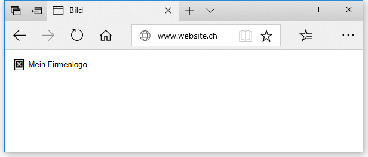

# Spezielle Tags

## Überschriften

Mit Überschriftelementen können bestimmte Teile des Inhaltes als Überschrift deklariert werden. Wie ein Buch einen Hauptitel und Kapitelüberschriften haben kann, können HTML Dokumente eine Hauptüberschrift und weitere Überschriften haben.

HTML besitzt sechs Überschrifttypen, wobei meist nur 3-4 gebraucht werden: `<h1>–<h6>`

```html
<h1>Ich bin eine Hauptüberschrift</h1>
<h2>Ich bin die höchste Unterüberschrift</h2>
<h3>Ich bin eine Unterüberschrift</h3>
<h4>Ich bin eine weitere Unterüberschrift</h4>
```

**Regel:** \
Jede Seite sollte genau eine Hauptüberschrift `<h1>` und beliebig viele Unterüberschriften `<h2>`-`<h6>` haben. Es sollten keine Ebenen übersprungen werden (z. B. `<h3>` gefolgt von `<h5>`). Dies ist unter anderem für die Suchmaschinen-Platzierung wichtig.

## Links

Links sind, was das Internet zu einem **NETZ/WEB** macht. Um einen Link zu implementieren, müssen wir das `<a>`-Element verwenden. `a` ist die Kurzform für "Anker" (engl. "anchor").&#x20;

Zuerst schreiben wir einen Absatz:

```html
<p>Heute ist ein schöner Tag in Luzern.</p>
```

Nun umschliessen wir die Wörter, welche wir als Link definieren möchten, mit einem `<a>`-Tag:

<pre class="language-html"><code class="lang-html"><strong>&#x3C;p>Heute ist ein &#x3C;a>schöner Tag&#x3C;/a> in Luzern.&#x3C;/p>
</strong></code></pre>

Mit dem `href`-Attribut definieren wir, wo der Link hinzeigen soll:

```html
<p>Heute ist ein <a href="https://luzerntourismus.roundshot.com/">schöner Tag</a> in Luzern.</p>
```

**Link in neuem Fenster / Tab öffnen:**

Wenn ein Link auf eine externe Website oder ein PDF verweist, sollte diese in einem neuen Tab oder neuen Fenster geöffnet werden, weil das Ziel die bisherige Navigation nicht mehr anbietet und so die Besucher nicht mehr leicht zurück finden. Dazu gibt es das Attribut `target`:

```html
<p>Heute ist ein <a href="https://luzerntourismus.roundshot.com/" target="_blank">schöner Tag</a> in Luzern.</p>
```

## Bilder

Das ``-Tag bettet ein Bild an der Stelle der Seite ein, wo es in der HTML-Struktur eingegliedert ist. Es tut dies mit dem `src` ('src' steht für 'source') Attribut, welches den Pfad zum gewünschen Bild beinhaltet.

```markup

```

Das genauso wichtige Attribut ist das `alt`-Attribut. Diese Attribut muss immer vorhanden sein. Es darf jedoch explizit leer gelassen werden.

Der Text im `alt`-Attribut wird angezeigt, wenn das Bild nicht geladen werden kann. Dies ist nützlich für Sehbehinderte, für Suchmaschinen (können keine Bilder sehen) und wenn es einen Fehler beim Laden des Bildes gibt. Dieser alternative Satz sollte dem Leser eine Informationen geben, damit er sich vorstellen kann, was auf dem Bild angezeigt ist.



Die Attribute `width` und `height` können optional angegeben werden, damit der Browser weiss, wie breit bzw. hoch die Bilder werden sollen. Die Werte sollten den wirklichen Pixel-Massen des Bildes entsprechen! Der Wert ist ohne "px". Wird nur width oder nur height angegeben, wird der andere Wert automatisch bewechnet.&#x20;

```html
<p>Heute ist ein 
<a href="https://luzerntourismus.roundshot.com/" target="_blank">schöner Tag</a> 
in Luzern.</p>
```

## Absatz (Paragraph) vs. Zeilenumbruch (Break)

Ähnlich wie in einem Textverarbeitungsprogramm gibt es in HTML zwei Arten von Umbrüchen:

* Das **`<p>`-Element** definiert einen neuen **Absatz (Paragraph)**. \
  &#xNAN;_&#x53;emantik:_ Inhaltlich beginnt hier etwas neues.\
  &#xNAN;_&#x4C;ayout:_ Zwischen Absätzen erzeugt der Browser einen kleinen Abstand.&#x20;
* Das **`<br>`-Element** definiert einen **Zeilenumbruch (Break)** innerhalb eines Absatzes. \
  Das `<br>`-Element  ist ein **leerer Tag**, hat also keinen Inhalt und kein schliessendes Tag. \
  &#xNAN;_&#x53;eminatik:_ Der Text gehört noch zum gleichen Inhalt, soll aber auf einer neuen Zeile stehen.\
  &#xNAN;_&#x4C;ayout:_ Der Browser erzeugt keinen Abstand zwischen den Zeilen. \
  **Nutze dieses Tag sparsam!**&#x20;
* Eine **neue Zeile in HTML** wird vom Browser ignoriert und dient nur dazu, den HTML-Code für den Programmierer übersichtlich zu gestalten.

```html
<p>Der erste Absatz enthält einen Umbruch<br>auf eine neue Zeile.</p>
<p>
    Etwas übersichtlicher sieht der Umbruch im Code<br>
    im Code so aus.
</p>
<p>
    Neue Zeilen im Code ohne Break-Tag 
    erscheinen im Browser auf einer Zeile.
</p>
```

**Resultat:** Teste mit [`codepen.io`](https://codepen.io/dosullz/pen/QNxdzd), wie das Resultat des obigen Codes im Browser aussieht.&#x20;

## 🛠️ Aufgabe

Gehe auf [Codepen.io](https://codepen.io/pen/) und probiere folgende Tags aus:

```html
- <h1> bis <h6>
- <p>
- <em>
- <strong>
- <a>
- 
- <br>
- Neue Zeile in HTML (ohne <br>)
```

**Tipp zum \:** Als src="..." kannst du testhalber einen Bildpfad aus einer beliebigen Website verwenden. Den findest du im Browser mit Rechts-Klick auf ein Bild > Bildadresse kopieren.
