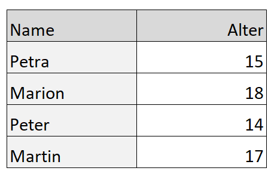

# 📖 Tabellen & Listen

## Tabellen

Eine Tabelle ist eine strukturierte Zusammenstellung von Daten in Spalten und Reihen. Eine Tabelle erlaubt es, eine Vielzahl von Daten mit einem konkreten Zusammenhang zu interpretieren und zu vergleichen.



Der Inhalt jeder Tabelle wird umschlossen von diesen zwei Tags: `<table></table>`:

```markup
<table></table>
```

#### Tabellen-Zellen (Daten)

Der kleinste Teil einer Tabelle ist eine Zelle. Sie wird mit dem `<td>`-Tag ('td' steht für 'table data') erstellt:

```markup
<table>
    <td>Name</td>
    <td>Alter</td>
    <td>Petra</td>
    <td>15</td>
    <td>Marion</td>
    <td>18</td>
    <td>Peter</td>
    <td>14</td>
    <td>Martin</td>
    <td>17</td>
</table>
```

Wenn du den Code z.B. mit [Codepen](https://codepen.io/pen/) testest, wirst du feststellen, dass die einzelnen Reihen nicht untereinander, sondern alle in einer Reihe sind:&#x20;

| Name | Alter | Petra | 15 | Marion | 18 | Peter | 14 | Martin | 17 |
| ---- | ----- | ----- | -- | ------ | -- | ----- | -- | ------ | -- |

#### Tabellen-Zeilen

Um eine neue Reihe zu erzwingen, nutzen wir das `<tr>`-Tag ('tr' steht für 'table row'):

```markup
<table>
    <tr>
        <td>Name</td>
        <td>Alter</td>
    </tr>
    <tr>
         <td>Petra</td>
         <td>15</td>   
    </tr>
    <tr>
        <td>Marion</td>
        <td>18</td>
    </tr>
    <tr>
        <td>Peter</td>
        <td>14</td>
    </tr>
    <tr>
        <td>Martin</td>
        <td>17</td>
    </tr>
</table>
```

#### Spalten-Überschriften

Die erste Reihe eine Tabelle ist meistens etwas spezielles, da sich dort keine Daten befinden, sondern Überschriften. HTML hat darum dafür ein eigenes Tag vorgesehen, das `<th>`-Tag ('th' steht für 'Table Heading'). Ersetze nun die `<td>`-Tags der ersten Reihe mit `<th>`-Tags:

```markup
<table>
    <tr>
        <th>Name</th>
        <th>Alter</th>
    </tr>
    <tr>
         <td>Petra</td>
         <td>15</td>   
    </tr>
    <tr>
        <td>Marion</td>
        <td>18</td>
    </tr>
    <tr>
        <td>Peter</td>
        <td>14</td>
    </tr>
    <tr>
        <td>Martin</td>
        <td>17</td>
    </tr>
</table>
```

## Listen

Wie auch Tabellen verfügen auch Listen über eine spezielle Anordnung der HTML-Elemente. So wird jede Liste mit einem `<ul>`-Tag ('ul' steht für 'unordered List') oder einem `<ol>`-Tag ('ol' steht für 'ordered List) umschlossen. Wir erstellen dazu gleich zwei Beispiele:

```markup
<ul></ul>
<ol></ol>
```

Der kleinste Teil einer Liste ist ein Aufzählungspunkt. Ein Aufzählungspunkt wird mit dem `<li>`-Tag erstellt. Erstellen wir nun die Inhalte der beiden Liste:

```markup
<ul>
    <li>Erster Punkt</li>
    <li>Zweiter Punkt</li>
    <li>Dritter Punkt</li>
</ul>
<ol>
    <li>Erster Punkt</li>
    <li>Zweiter Punkt</li>
    <li>Dritter Punkt</li>
</ol>
```

Indem man eine Liste in einen Aufzählungspunkt setzt, wird keine Unterliste erstellt:

```markup
<ul>
    <li>Erster Punkt</li>
    <li>Zweiter Punkt</li>
    <li>Dritter Punkt
        <ul>
            <li>Erster Unterpunkt</li>
            <li>Zweiter Unterpunkt</li>
        </ul>
    </li>
</ul>
<ol>
    <li>Erster Punkt</li>
    <li>Zweiter Punkt</li>
    <li>Dritter Punkt
        <ol>
            <li>Erster Unterpunkt</li>
            <li>Zweiter Unterpunkt</li>
        </ol>
    </li>
</ol>
```

Die Listen-Typen lassen sich auch beliebig miteinander kombinieren:

```markup
<ul>
    <li>Erster Punkt</li>
    <li>Zweiter Punkt</li>
    <li>Dritter Punkt
        <ol>
            <li>Erster Unterpunkt</li>
            <li>Zweiter Unterpunkt</li>
        </ol>
    </li>
</ul>
<ol>
    <li>Erster Punkt</li>
    <li>Zweiter Punkt</li>
    <li>Dritter Punkt
        <ul>
            <li>Erster Unterpunkt</li>
            <li>Zweiter Unterpunkt</li>
        </ul>
    </li>
</ol>
```
