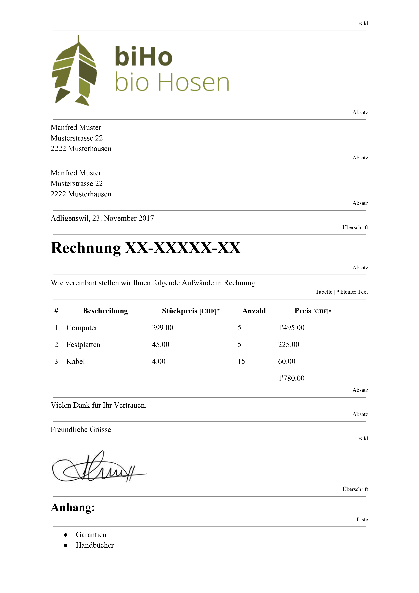

# Rechnung erstellen

## Aufgabenstellung

1. Suche dir eine Firma aus und lade deren Logo als Bild herunter.
2. Unterschreibe auf einem weissen Blatt Papier und fotografiere die Unterschrift mit deinem Natel und übertrage das Foto auf deinen Computer.
3. Erstelle eine Datei mit dem HTML-Grundgerüst und speichere diese unter dem Namen `invoice.html`.
4. Erfasse die Inhalte der Rechnung und strukturiere diese mit der HTML-Auszeichnungssprache gemäss der Rechnungsvorlage unten.
5. Kopiere den Code anschliessend in den HTML-Validator und korrigiere allfällige Fehler.

## Rechnungsvorlage

Hier findest Du die Rechnung noch als [PDF](https://github.com/johannesE/modul-101/tree/7ef76a9c9f706911092af198dd248f9a2832f329/Tag%201/03%20HTML/06%20HTML-Aufgabe/src/Rechnungsvorlage.pdf).

