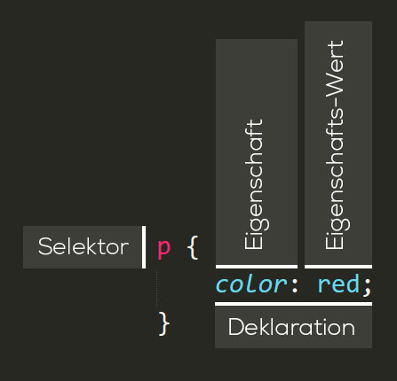

# 📖 CSS Gundlagen

Wie HTML ist auch CSS keine Programmiersprache sondern eine Stylesheet-Sprache.

CSS erlaubt es, für Elemente auf einer Website das Aussehen festzulegen. Zum Beispiel benötigt man folgengen CSS-Code, um alle Absätze (`<p>`) auszuwählen und deren Inhalt rot einzufärben:

```css
p {
  color: red;
}
```

## Aufbau einer CSS-Regel

Die ganze Struktur wird Regelsatz (oder oft nur Regel) genannt:



### Bestandteile

**Selektor** - Der HTML-Elementname steht am Anfang der Regel. Er wählt die Elemente, die gestaltet werden sollen (in diesem Beispiel `p`). Selektoren dienen dazu, in CSS bestimmte Elemente eines HTML-Dokuments zu adressieren, um sie zu gesalten:&#x20;

<figure><figcaption></figcaption></figure>

**Deklaration** - Eine einzelne Regel wie `color: red;` gibt an, welche Eigenschaft des Elements gestaltet werden soll. Eine Deklaration besteht aus einer Eigenschaft (`color`) und einem Eigenschafts-Wert (`red`).

**Eigenschaft (englisch: property)** - Art wie das ausgewählte HTML-Element gestaltet werden soll. In diesem Fall ist `color` eine Eigenschaft des `<p>` Elements.

**Eigenschafts-Wert (englisch: property value)** - Rechts neben der Eigenschaft, nach dem Doppelpunk, steht der Wert der Eigenschaft. Dieser gibt eine von vielen Möglichkeiten wieder, wie die Eigenschaft das Aussehen eines Elements verändern kann.

### Syntax

* Hinter dem Selektor stehen die zugehörigen Regeln innerhalb geschwungener Klammern (`{}`).
* Innerhalb einer Deklaration muss man einen Doppelpunkt (`:`) nutzen, um Eigenschaft und Wert zu trennen.
* Am Ende jeder Deklaration muss ein Semikolon (;) gesetzt werden. Dieser trennt mehrere Deklarationen voneinander ab.

```css
p {
  color: red;
  width: 500px;
  border: 1px solid black;
}
```
