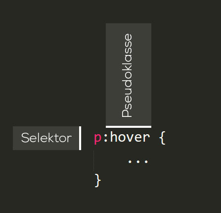

# 📖 CSS Selektoren

## Übersicht

Selektoren-Arten:

* [Element-Selektor (Tag-Selektor)](03-selektoren.md#element-selektor-oder-tag-selektor)
* [Klassen-Selektor](03-selektoren.md#klassen-selektor)
* [ID-Selektor](03-selektoren.md#id-selektor)
* [Pseudoklassen-Selektor](03-selektoren.md#pseudoklassen-selektor)
* [Attribut-Selektor](03-selektoren.md#attribut-selektor)

## Selektoren-Arten

### Element-Selektor (Tag-Selektor)

Auch Tag- oder Typ-Selektor genannt. Alle HTML-Elemente eines bestimmten Typs werden ausgewählt.

```css
p {
    color: red;
}
```

```html
<p>Wird ausgewählt</p>
<p>Wird auch ausgewählt</p>

<div>Wird nicht ausgewählt</div>
```

### ID-Selektor

Elemente mit der entsprechenden ID werden ausgewählt. Eine ID kann immer nur einem einzigen Element innerhalb eines Dokuments zugeordnet werden.

```css
#important {
    color: red;
}
```

```html
<p id="important">Wird ausgewählt</p>

<p>Wird nicht ausgewählt</p>
```

### Klassen-Selektor

Elemente mit der entprechenden Klasse werden ausgewählt. Klassen können mehreren Elementen innerhalb eines Dokuments zugeordnet werden.

```css
.important-text {
    color: red;
}
```

```html
<p class="important-text">Wird ausgewählt</p>
<p class="important-text">Wird auch ausgewählt</p>

<p>Wird nicht ausgewählt</p>
```

### Namensgebung

*   Verzichte auf Sonderzeichen bei der Verwendung des `class`- und des `id`-Attributs. Auch wenn dies

    von CSS unterstützt wird, kann es zu unerwarteten Problemen führen.
* Verwende englische Begriffe.
* Da die Gross- und Kleinschreibung relevant ist, empfiehlt es sich, alles in Kleinbuchstaben zu schreiben.
* Leerzeichen sind nicht erlaubt, verwende `-` bei Klassen oder IDs mit mehreren Worten (z. B. `main-navigation`).

### Pseudoklassen-Selektor

Mit Pseudoklassen lässt sich eine Seite nicht nur in Bezug auf die Struktur des Inhalts gestalten, sondern auch im Bezug auf andere Faktoren wie zum Beispiel dem Browserverlauf (`:visited`), Reihenfolge der Elemente (`:first-child`) oder die Position des Mauszeigers (`:hover`).



Die Pseudoklasse wird angeführt mit einem Doppelpunkt und hinter den regulären Selektor angefügt.

#### Links (\<a>)

Vorallem bei Links (`<a>`) sind die Pseudoklassen wichtig, um den Website-Besucher mitzuteilen, dass es sich hier beispielswiese um klickbare Elemente handelt.

| Pseudoklasse | Ausgewählte Elemente                                                        |
| ------------ | --------------------------------------------------------------------------- |
| `a:link`     | Dies wählt jeden Link aus, der bisher noch nicht besucht wurde.             |
| `a:visited`  | Dies wählt jeden Link aus, der bereits besucht wurde.                       |
| `a:hover`    | Dies wählt einen Link aus über dem sich der Mauszeiger gerade befindet.     |
| `a:active`   | Dies wählt jedes Element aus, welches vom Benutzer momentan angelickt wird. |

#### Sonstige nützliche Pseudoklassen

| Pseudoklasse                           | Ausgewählte Elemente                                                                                                                                            |
| -------------------------------------- | --------------------------------------------------------------------------------------------------------------------------------------------------------------- |
| `:first-child`                         | Dies wählt jedes Element aus, welches das erste Kindelement seines Elternelements ist.                                                                          |
| `:last-child`                          | Dies wählt jedes Element aus, welches das letzte Kindelement seines Elternelement ist.                                                                          |
| `:nth-child()`                         | In der Klammer dieser Pseudoklasse muss noch ein Wert mitgegeben werden - Beispiel: 2n. So wird jedes 2te Kindelement seines Elternelements ausgewählt.         |
| <p><code>:has()</code><br><br><br></p> | <p>Dies wählt jedes Element aus, welches einen angegebenen Nachfolger hat. <br>Diese Pseudoklasse wird erst seit 2023 von den meisten Browsern unterstützt.</p> |

#### Beispiele zu Pseudoklassen

<pre class="language-css"><code class="lang-css"><strong>a {
</strong>    color: blue;
}
a:hover {
    color: red;
}
a:nth-child(2) {
    font-weight: bold;
}
a:has(img) {
    box-shadow: 5px 5px 5px grey;
}
</code></pre>

```html
<p>
  <a href="css.html">Wird rot wenn der Mauszeiger darüber fährt.</a>
  <a href="shop.html">Ist fett</a>
  <a href="shop.html">Ist nicht fett</a>
</p>
<a href="shop.html"><br>Mit Schatten</a>
```

### Attribut-Selektor

Elemente mit entsprechendem Attribut werden ausgewählt.

```css
a[target="_blank"] {
    color: red;
}
```

```html
<a href="kontakt.html" target="_blank">Wird ausgewählt</p>
<a href="kontakt.html">Wird ausgewählt</p>
```
