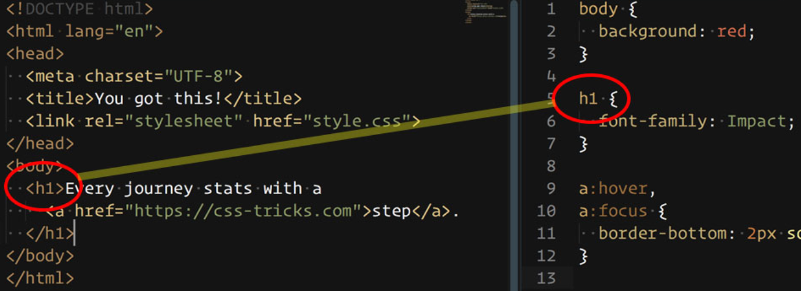

# CSS Selektoren

## Zweck

Selektoren dienen dazu, in CSS bestimmte Elemente eines HTML-Dokuments zu adressieren, um sie zu gesalten:

<figure><figcaption></figcaption></figure>

## Verschiedene Arten von Selektoren

Einfache Selektoren:

* [Element-Selektor (oder Tag-Selektor)](03-selektoren.md#element-selektor-oder-tag-selektor)
* [ID-Selektor](03-selektoren.md#id-selektor)
* [Klassen-Selektor](03-selektoren.md#klassen-selektor)

Fortgeschrittene Selektoren:

* [Attribut-Selektor](03-selektoren.md#attribut-selektor)
* [Pseudoklassen-Selektor](03-selektoren.md#pseudoklassen-selektor)

Selektoren kombinieren und verschachteln:

* [Mehrfach-Selektor](03-selektoren.md#mehrfach-selektor)
* [Nachfahren-Selektor](03-selektoren.md#nachfahren-selektor)
* [Kind-Selektor](03-selektoren.md#kind-selektor)

## Einfache Selektoren

### Element-Selektor (oder Tag-Selektor)

Auch Tag- oder Typ-Selektor genannt. Alle HTML-Elemente eines bestimmten Typs werden ausgewählt.

```css
p {
    color: red;
}
```

```html
<p>Wird ausgewählt</p>
<p>Wird auch ausgewählt</p>

<div>Wird nicht ausgewählt</div>
```

### ID-Selektor

Elemente mit der entsprechenden ID werden ausgewählt. Eine ID kann immer nur einem einzigen Element innerhalb eines Dokuments zugeordnet werden.

```css
#important {
    color: red;
}
```

```html
<p id="important">Wird ausgewählt</p>

<p>Wird nicht ausgewählt</p>
```

### Klassen-Selektor

Elemente mit der entprechenden Klasse werden ausgewählt. Klassen können mehreren Elementen innerhalb eines Dokuments zugeordnet werden.

```css
.important-text {
    color: red;
}
```

```html
<p class="important-text">Wird ausgewählt</p>
<p class="important-text">Wird auch ausgewählt</p>

<p>Wird nicht ausgewählt</p>
```

### 🛠️ Aufgaben

1. Definiere in der Seite "Über mich" für alle `<h1>` eine Farbe und eine Schriftart.
2. Füge den beiden Adressblöcken uin HTML eine Klasse "address" hinzu und definiere dafür in CSS, dass diese Kursiv und dunkelgrau statt schwarz sein sollen.
3. Definiere für alle Tabellen-Header `<th>`, dass sie Linksbündig sein sollen und eine helle Hintergrundfarbe haben.
4. Definiere für alle Tabellen-Zellen `<th>` und `<td>` einen Innenabstand (`padding`) von 5px.

## Forteschrittene Selektoren

### Attribut-Selektor

Elemente mit entsprechendem Attribut werden ausgewählt.

```css
a[target="_blank"] {
    color: red;
}
```

```html
<a href="kontakt.html target="_blank">Wird ausgewählt</p>
<a href="kontakt.html>Wird ausgewählt</p>
```

### Pseudoklassen-Selektor

Mit Pseudoklassen lässt sich eine Seite nicht nur in Bezug auf die Struktur des Inhalts gestalten, sondern auch im Bezug auf andere Faktoren wie zum Beispiel dem Browserverlauf (`:visited`), Reihenfolge der Elemente (`:first-child`) oder die Position des Mauszeigers (`:hover`).


Die Pseudoklasse wird angeführt mit einem Doppelpunkt und hinter den regulären Selektor angefügt.

#### Links (\<a>)

Vorallem bei Links (`<a>`) sind die Pseudoklassen wichtig, um den Website-Besucher mitzuteilen, dass es sich hier beispielswiese um klickbare Elemente handelt.

| Pseudoklasse | Ausgewählte Elemente                                                        |
| ------------ | --------------------------------------------------------------------------- |
| `a:link`     | Dies wählt jeden Link aus, der bisher noch nicht besucht wurde.             |
| `a:visited`  | Dies wählt jeden Link aus, der bereits besucht wurde.                       |
| `a:hover`    | Dies wählt einen Link aus über dem sich der Mauszeiger gerade befindet.     |
| `a:active`   | Dies wählt jedes Element aus, welches vom Benutzer momentan angelickt wird. |

#### Sonstige nützliche Pseudoklassen

| Pseudoklasse                           | Ausgewählte Elemente                                                                                                                                            |
| -------------------------------------- | --------------------------------------------------------------------------------------------------------------------------------------------------------------- |
| `:first-child`                         | Dies wählt jedes Element aus, welches das erste Kindelement seines Elternelements ist.                                                                          |
| `:last-child`                          | Dies wählt jedes Element aus, welches das letzte Kindelement seines Elternelement ist.                                                                          |
| `:nth-child()`                         | In der Klammer dieser Pseudoklasse muss noch ein Wert mitgegeben werden - Beispiel: 2n. So wird jedes 2te Kindelement seines Elternelements ausgewählt.         |
| <p><code>:has()</code><br><br><br></p> | <p>Dies wählt jedes Element aus, welches einen angegebenen Nachfolger hat. <br>Diese Pseudoklasse wird erst seit 2023 von den meisten Browsern unterstützt.</p> |

#### Beispiele zu Pseudoklassen

<pre class="language-css"><code class="lang-css"><strong>a {
</strong>    color: blue;
}
a:hover {
    color: red;
}
a:nth-child(2) {
    font-weight: bold;
}
a:has(img) {
    box-shadow: 5px 5px 5px grey;
}
</code></pre>

```html
<p>
  <a href="css.html">Wird rot wenn der Mauszeiger darüber fährt.</a>
  <a href="shop.html">Ist fett</a>
  <a href="shop.html">Ist nicht fett</a>
</p>
<a href="shop.html"><br>Mit Schatten</a>
```

### 🛠️ Aufgabe

* Definiere für deine Links einen Hover-Effekt.

## Selektoren kombinieren und verschachteln

### Mehrfach-Selektor

Um Elemente gleichzeitig über mehrere Attribute auszuwählen, kette diese einfach aneinander:

```css
.card.headline { /* Gilt nur für Elemente mit .card und .headline */
  color: red;
}
div.card {
  /* Gilt nur für <div>-Elemente mit .card */
  border: 1px solid blue;
}
```

```html
<article class="card">Ich habe eine Klasse</div>
<article class="card headline">Ich habe zwei Klassen</div>
<div class="card">Ich bin ein Div-ELement mit Klasse</div>
```

### Nachfahren-Selektor

Beim `Nachfahren-Selektor` werden zwei Selektoren durch ein Leerzeichen voneinander getrennt. Der Selektor spricht das zuletzt erwähnte Element nur dann an, wenn es ein `Nachfahre` des vorhergehenden Elements ist.

Als `Nachfahre` werden alle Elemente innerhalb eines anderen Elements bezeichnet (Kinder, Kindeskinder etc.)

```css
.sub-navi a { /* Formatiere alle a unterhalb von .sub-navi */
  color: red;
}
```

```html
<nav class="navi">
  <a href="test.html">Dieser Link ist NICHT rot</a>
</nav>
<nav class="sub-navi">
  <a href="test.html">Dieser Link ist rot</p>  
  <div>
    <a href="test.html">Dieser Link ist rot</a>
  </div>
</nav>
```

### Kind-Selektor

Beim `Kind-Selektor` werden zwei Selektoren durch ein `>` voneinander getrennt. Der Selektor spricht das zuletzt erwähnte Element nur dann an, wenn es ein direktes `Kind` des vorhergehenden Elements ist.

Als `Kind` werden alle Elemente _direkt unterhalb_ eines anderen Elements bezeichnet.

```css
.sub-navi > a { /* Formatiere alle a direkt unterhalb von .sub-navi */
  color: red;
}
```

```html
<nav class="sub-navi">
  <a href="test.html">Dieser Link ist rot</p>  
  <div>
    <a href="test.html">Dieser Link ist NICHT rot</a>
  </div>
</nav>
```

### Mehrere Elemente auswählen

Teilen sich mehrere Elemente die gleichen Regeln, können diese miteinander selektiert werden. Dazu werden einfach mehrere Selektoren hintereinander geschrieben, getrennt durch Kommas:

```css
h1, .sub-navi, footer {
  color: red;
}
```

### 🛠️ Aufgabe

* Gebe nur Links, die in einer Tabelle vorkommen, eine andere Farbe.
