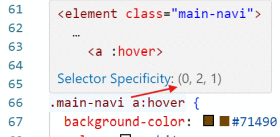

# CSS Kaskadierung

An einem Punkt wird es dazu kommen, dass mehrerere CSS-Regeln das gleiche Element ansprechen.

#### index.html

```markup
<p class="red">Mein roter Text.</p>
```

#### style.css

```css
p {
    color: black;
}

.red {
    color: red;
}
```

In diesen Fällen stellt sich die Frage: Welche CSS Regel «gewinnt» und wird auf das angesteuerte Element angewendet? Dies wird nicht einfach dem Zufall überlassen, sondern über einen Mechanismus namens «Cascading» oder Kaskadierung bestimmt.

## Kaskadierung

CSS ist ein Akronym für **\*Cascading** Style Sheet\*. Bei der Kaskadierung geht es darum, dass der Style einmal gestalteter Elemente an anderer Stelle überschrieben werden kann.&#x20;

**Beispiel:** Ein Link bekommt generell eine bestimmte Farbe, in der Navigation soll sie aber mit einer anderen Farbe überschrieben werden.&#x20;

Es entscheiden drei Faktoren darüber, welche CSS-Regel «gewinnt»:

1. Wichtigkeit
2. Spezifizierung
3. Platzierung / Reihenfolge

Als kleine Überlegungshilfe gibt es hier das [Punktesystem](https://github.com/johannesE/modul-101/tree/7ef76a9c9f706911092af198dd248f9a2832f329/Tag%201/04%20CSS/05%20Kaskadierung/src/kaskadierung\_spezifikation.pdf). \
Wenn du in Visual Studio Code über einen Selektor fährst, wird das Punktesystem angezeigt:&#x20;

<div align="left">

<figure><figcaption></figcaption></figure>

</div>

### Wichtigkeit

In CSS kann man mit einem Schlüsselwort sicher stellen, dass einige Deklarationen _immer_ wichtiger sind als andere, also immer «gewinnt»: `!important`.

#### index.html

```markup
<p class="red">Mein roter Text.</p>
```

#### style.css

```css
p {
    color: black !important;
}

.red {
    color: red;
}
```

Im oben gezeigten Beispiel wird die Schrift schwarz angezeigt, da diese CSS-Regel mit der Syntax `!important` deklariert wurde.

**WICHTIG:** Es macht nur Sinn diese Syntax einzusetzen, wenn man absolut keine andere Wahl hat. Diese Syntax ändert nähmlich die Art und Weise komplett, wie die Logik der Kaskadierung normalerweise funktioniert. Die Notwendigkeit, `!important` zu verwenden, ist meist ein Hinweis auf schlecht strukturierten CSS-Code.

### Spezifizierung

Eine CSS-Regel ist umso stärker, desto spezifischer der Selektor definiert wurde.

* Typen-Selektoren (`p`) haben die niedrigste Spezifizierung und sind deshalb am schwächsten.
* `class`-Selektoren (`.red`) haben eine höhere Spezifizierung und sind deshalb stärker als Typen-Selektoren.
* `id`-Selektoren (`#help`) haben die höchste Spezifität und sind deshalb stärker als Typen- und `class`-Selektoren.
*   Verschachtelte Selektoren haben eine höhere Spezifizierung als nicht verschachtelte:&#x20;

    ```css
    /* Diese Regel überschreibt die unten aufgeführte Regel. */
    .navigation a {
      color: red;
    }
    /* a:hover ist genauer spezifiziert als a, gewinnt also beim Mouse-Over */
    a:hover {
      color: green;
    }

    a {
      color: blue;
    }
    ```

### Platzierung / Reihenfolge

Sind sowohl Wichtigkeit und Spezifizierung von zwei Selektoren identisch, entscheidet schlussendlich die Platzierung. Die Regel, die als letztes kommt, überschreibt die vorherigen.&#x20;

```css
p {
  color: blue;
}

/* Diese Regel überschreibt die oben aufgeführte Regel. */
p {
  color: red;
}
```

## 🛠️ Aufgabe


Versuche nun mit Hilfe der Kaskadierung eine CSS-Regel des `paper.css` zu überschreiben. Färbe dazu den Schatten (`box-shadow`) des Papiers blau.
