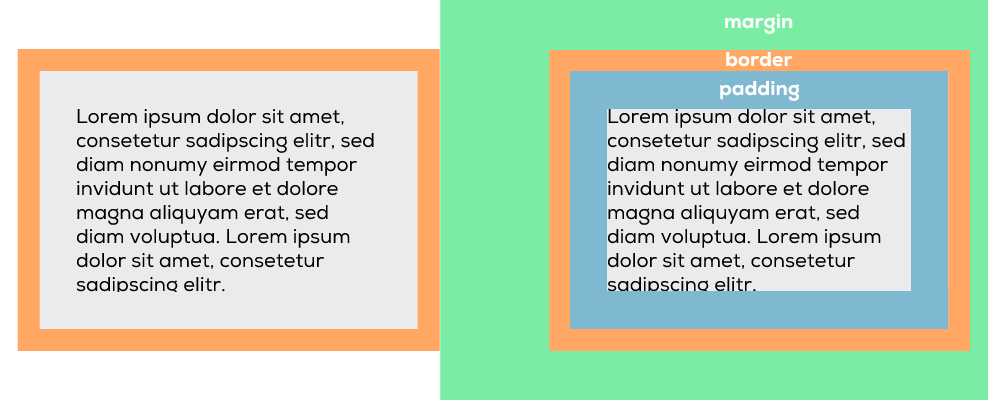

# Boxmodell

Wie dir vielleicht bereits aufgefallen ist, geht es bei Webseiten oft darum, Boxen zu erstellen (HTML) und Boxen zu gestalten (CSS). Die meisten HTML-Elemente sind somit Boxen oder Schachteln, welche übereinander und nebeneinander gestapelt werden.

Mit CSS können Grösse, Farben, Position usw. bestimmt werden.

<div align="center"></div>

## Eigenschaften von Boxen

Das CSS-Layout basiert auf dem Box-Modell. Jede Box, die Platz auf einer Webseite einnimmt, hat unter anderen folgende Eigenschaften:

* **Aussenabstand (`margin`):** \
  Der Abstand vom Border bis zum nächsten benachbarten Element.
* **Rahmen (`border`):** \
  Der Border ist der Rahmen um ein Element.
* **Innenabstand (`padding`):** \
  Das Padding ist der Raum zwischen Inhalt und Rahmen eines Elements.



### 🛠️ Erforschen

1. Rufe eine beliebige Website im Internet auf, öffne die "Developer Tools" (Rechtsklick auf ein Element > "Untersuchen" oder `F12`) und suche das Tab "Computed".&#x20;
2. Schau dir die Grafik des Box-Models eines HTML-Elements unter "Computed" an und darunter, woher die Abstände in CSS kommen.&#x20;
3. Wechsle zwischen den Tabs "Styles" und "Computed", das ist anders?&#x20;
4. Untersuche noch ein paar andere Elemente auf der gleichen Seite.&#x20;

### Beispiele: 4 Seiten einer Box - top, right, bottom, left

Die Abstände und Rahmen einer Box können für alle 4 Seiten einzeln oder zusammen oder einzeln definiert werden. Ein paar Beispiele:&#x20;

```css
.element-x {
    margin: 20px; /* Aussenabstand 20px, auf allen Seiten gleich */
    border: 1px solid blue; /* Rahmen: 1px breit, durchgezogen, blau */
    border-bottom: 2px double; /* Rahmen unten überschreiben (breiter) */
    padding-top: 10px; /* Innenabstände... */
    padding-right: 20px;
    padding-bottom: 15px;
    padding-left: 20px;
}
.element-y {
    margin: 0 40px; /* Aussenabstand oben & unten 0px, rechts & links 40px */
    border: 2px dashed #CC0000; /* Rahmen: 2px, gestrichelt, rot */
    border-radius: 10px; /* Runde Ecken */
    padding: 10px 20px 15px 20px; /* Innenabstand wie oben, zusammengefasst: oben rechts unten links */
}
.image {
    border-radius: 50%; /* Schneidet ein Bild kreisrund aus */
}
```

### 🛠️ Ausprobieren

Probier die Möglichkeiten aus: [w3schools.com/css/tryit.asp?filename=trycss\_boxmodel](https://www.w3schools.com/css/tryit.asp?filename=trycss_boxmodel)
