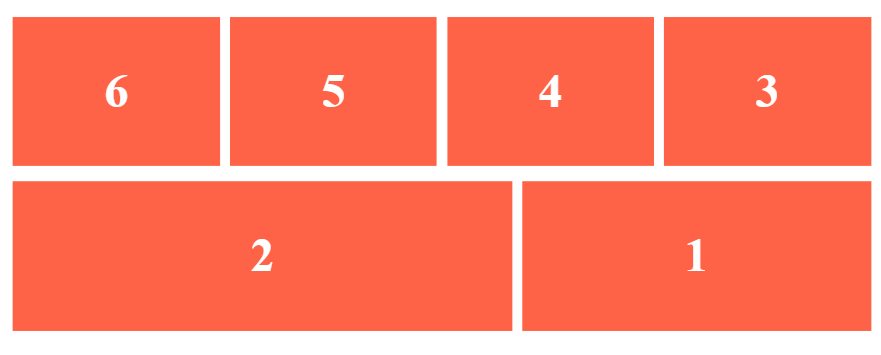

# 🛠️ Aufgabe Boxen

Die Aufgabendateien findest du in der Datei «boxen.zip». Lade die Datei herunter und entpacke das Zip-Archiv.&#x20;


Download Aufgabendateien


## Aufgabe 1

Ergänze den Flex-Container mit den nötigen CSS-Deklarationen (an der Stelle mit dem Vermerk `Aufgabe 1`), damit das Ergebnis bei den aufgeführten Bildschirmbreiten so aussieht:

### Bildschirm breit

.png>)

### Bildschirm schmal

.png>)

## Aufgabe 2

Ergänze die Flex-Items mit den nötigen CSS-Deklarationen (an der Stelle mit dem Vermerk `Aufgabe 2`), damit das Ergebnis bei den aufgeführten Bildschirmbreiten so aussieht:

### Bildschirm breit

### Bildschirm schmal

