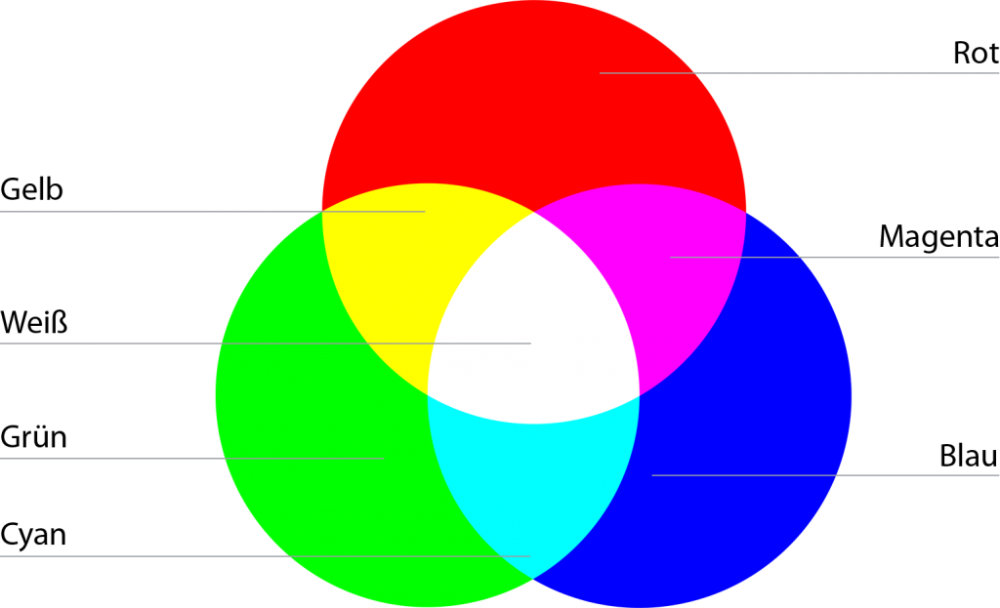
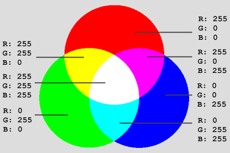
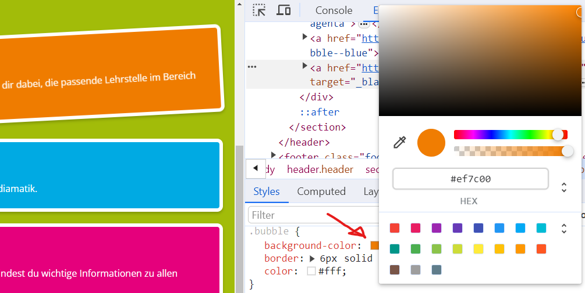
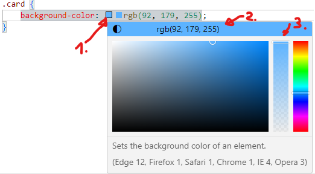

# Farben

## Farbmodelle

### RGB-Farbmodell

Auf Bildschirmen und Beamer werden die Farben _additiv_ aus den drei Grundfarben **R**ot, **G**rün und **B**lau zusammengemischt:&#x20;

<figure><figcaption><p>RGB Farbodell</p></figcaption></figure>

In CSS können Farben mit Farbnamen oder Farbwerten Arten definiert werden.

### Farbnamen

z.B. black, white, red, darkgrey, lightblue, rebeccapurple, orange.&#x20;

```css
.navigation {
    color: darkblue;
    background-color: lightgrey;
}
```

\> [Liste aller unterstützen Farbnamen](https://www.w3schools.com/cssref/css_colors.php)

### RGB-Farbwerte

Es gibt viele [verschiedene Farbmodelle](https://developer.mozilla.org/en-US/docs/Web/CSS/color_value), die in CSS genutzt werden können. Die häufigsten sind Angaben auf RGB-Basis:&#x20;

<figure><figcaption><p>RGB Farbmodell mit Farbwerten</p></figcaption></figure>

```css
/* RGB (Red, Green, Blue): */
color: rgb(254, 233, 93);

/* RGB Hexadezimal: */
color: #fee95d;
```

Wenn die beiden Hexadezimal-Ziffern je Farbe übereinstimmen, können die abgekürzt werden:&#x20;

```css
color: #fff; /* = #ffffff */
color: #d20; /* = #dd2200 */
color: #000; /* = #000000 */
```

Beide können zusätzlich eine 4. Zahl für Transparenz enthalten:&#x20;

```css
/* RGB (Red, Green, Blue) mit 50% Transparenz: */
color: rgba(254, 233, 93, 0.5);

/* RGB Hexadezimal mit 50% Transparenz*/
color: #fee95d88;
```

### Andere Farbmodelle

#### HSL (Hue, Saturation, Lightness)&#x20;

* **Beschreibung:** Beschreibt Farben auf einer intuitiveren Weise: Farbton (Hue), Sättigung (Saturation) und Helligkeit (Lightness).
* **Syntax:** [hsl(Farbton, Sättigung, Helligkeit)](https://developer.mozilla.org/de/docs/Web/CSS/Reference/Values/color_value/hsl).
  * **Farbton (Hue):** Ein Winkel von 0 bis 360 Grad.
  * **Sättigung (Saturation):** Ein Prozentsatz von 0% bis 100%.
  * **Helligkeit (Lightness):** Ein Prozentsatz von 0% bis 100%.
* **Beispiel:** `hsl(30, 100%, 50%)` für ein reines Orange.&#x20;

#### HWB (Hue, White, Black)&#x20;

* **Beschreibung:** Kombiniert Farbton mit Anteilen von Weiß und Schwarz.
* **Syntax:** [hwb(Farbton, Weißanteil, Schwarzanteil)](https://developer.mozilla.org/de/docs/Web/CSS/Reference/Values/color_value/hwb).
* **Beispiel:** `hwb(30, 0%, 0%)` ist reines Orange.
* **Besonderheit:** Eine Farbe wird durch die Menge an reinem Farbton, reinem Weiß und reinem Schwarz definiert. Je mehr Weiß und Schwarz hinzugefügt wird, desto mehr wird die Farbe gedämpft.&#x20;

#### LAB (CIELAB)&#x20;

* **Beschreibung:** Ein Farbraum, der die menschliche Farbwahrnehmung nachbildet. Er besteht aus Helligkeit und den Achsen a (Grün-Rot) und b (Blau-Gelb).
* **Syntax:** [lab(Helligkeit, a, b)](https://developer.mozilla.org/de/docs/Web/CSS/Reference/Values/color_value/lab).
* **Beispiel:** `lab(50, 50, 70)`.&#x20;

#### LCH (Luminance, Chroma, Hue)&#x20;

* **Beschreibung:** Auch ein geräteunabhängiger Farbraum, der auf CIELAB basiert, aber Helligkeit, Sättigung (Chroma) und Farbton verwendet.
* **Syntax:** [lch(Helligkeit, Sättigung, Farbton)](https://developer.mozilla.org/de/docs/Web/CSS/Reference/Values/color_value/lch).
* **Beispiel:** `lch(50, 70, 30)`.

## Farbwähler

### Im Browser und in Visual Studio Code

Im Browser kannst du über Rechts-Klick > Untersuchen oder mit \[F12] in die DevTools wechseln und dort die Farbe eines Elements in CSS finden und verändern:&#x20;

<figure><figcaption><p>DevTools Farbwähler</p></figcaption></figure>

In Visual Studio Code gibt es beim Bearbeiten von CSS ein ähnliches Tool:&#x20;

<figure><figcaption><p>Farbwähler in Visual Studio Code</p></figcaption></figure>

1. Farbwähler öffnen
2. Zwischen Farbmodellen umschalten
3. Transparenz setzen

### Links

* [Farbwähler: Farbwerte finden und umwandeln](https://www.mediaevent.de/css/farbrechner.html) (Mediaevent)
* [Farbrad zum Generieren einer ganzen Farbpalette](https://color.adobe.com/de/create/color-wheel) (Adobe)
* [Weitere Arten von Farbwerten selber ausprobieren](https://developer.mozilla.org/en-US/docs/Web/CSS/color) (Mozilla)
