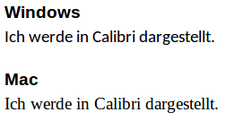

# Schriftarten

## Schriftarten

Um die Schriftart eines Elements auf einer Website zu ändern, kann die `font-family` Property verwendet werden:

```css
body {
    font-family: "Calibri";
}
```

Die Verwendung von `"Anführungszeichen"` ist optional, wenn die Schriftart keine Leerzeichen im Namen hat.

### Das Problem

Im Web werden die Schriftarten **vom Computer des Besuchers** geladen, dies kann zu Problemen führen. Nutzt der Besucher Windows als Betriebssystem, wird die Schrift korrekt angezeigt. Besucht man die Website jedoch auf einem Mac, gibt es Darstellungsprobleme, weil die Schriftart `Calibri` auf einem Mac nicht vorinstalliert ist.



### Alternative Schriftarten

Um dieses Problem zu umgehen können mehrere Schriftarten definiert werden.

Diese Definition bezeichnet man als `Font Stack`. Die erste Schriftart, die auf dem System des Besuchers installiert ist, wird verwendet.

```css
body {
    font-family: "San Francisco", "Calibri", "Arial", "Ubuntu";
    /*           ^ Für Mac        ^ für Windows       ^ für Linux */
}
```

Auf [cssfontstack.com](https://www.cssfontstack.com/) gibt es vordefinierte Font Stacks mit ähnlichen Schriftarten.

### Generische Schriftfamilie

Den Font Stack sollte man immer mit den generischen Schriftfamilien `serif`, `sans-serif` oder `monospace` abschliessen.

Wird auf dem System keine der definierten Schriftarten gefunden, wird die **Standard-Schriftart** für den definierten Schrifttyp gewählt. Welche Schriftart das genau ist, ist abhängig vom Betriebssystem, vom verwendeten Browser und von benutzerdefinierten Einstellungen des Besuchers.

```css
body {
    font-family: "Calibri", "San Francisco", "Arial", sans-serif;
}

.code-editor {
    font-family: "Source Sans Pro", "Roboto Mono", "Consolata", monospace;
}
```

### Eigene Schriftarten einbinden

Seit CSS3 können auch eigene Schriftarten für ein Dokument verwendet werden. Hier gilt es folgende Punkte zu beachten:

* Die Schriftart **muss auf einem Server** gehostet werden. Sie wird beim Aufruf einer Website heruntergeladen.
* Die Lizenz der Schriftart muss die Verwendung im Web zulassen.
* Die Einbindung einer eigenen Schriftart beeinflusst die **Ladezeit einer Website**, da mehr Daten heruntergeladen werden müssen.

#### `@font-face`

Mit der `@font-face` Regel können eigene Schriftarten definiert werden:

```css
@font-face {
    font-family: "ICT-BZ Sans";
    src: url("./fonts/ict_bz_sans.otf");
}

body {
    font-family: "ICT-BZ Sans";
}
```

**Google Web Fonts**

Auf [fonts.google.com](https://fonts.google.com/) befindet sich eine grosse Sammlung von Schriftarten, die uneingschränkt im Web verwendet werden können.

Die Schriftarten werden von Google gehosted und können über eine einfache CSS-Datei eingebunden werden:

```markup
<link href="https://fonts.googleapis.com/css?family=Roboto:400,700" rel="stylesheet">
```

Achte auch hier darauf, nicht zu viele Schriftarten und Schriftstile einzubinden, da sie die Ladezeit deiner Website stark beinflussen können.

Eine spezielle Funktion von Google Fonts ist, dass überprüft wird, mit welchem Browser die Datei geladen wird und immer nur die Schriftformate (`woff2`, `ttf`, `otf`, etc.) in der CSS-Datei verwendet werden, die der Browser unterstützt.

Wird die CSS-Datei direkt aufgerufen, sehen wir die soeben besprochenen `@font-face` Regeln.

```css
/* Quellcode von https://fonts.googleapis.com/css?family=Roboto:400,700 */

@font-face {
  font-family: 'Roboto';
  font-style: normal;
  font-weight: 400;
  src: local('Roboto'), local('Roboto-Regular'), url(https://fonts.gstatic.com/s/roboto/v18/ek4gzZ-GeXAPcSbHtCeQI_esZW2xOQ-xsNqO47m55DA.woff2) format('woff2');
}
@font-face {
  font-family: 'Roboto';
  font-style: normal;
  font-weight: 700;
  src: local('Roboto Bold'), local('Roboto-Bold'), url(https://fonts.gstatic.com/s/roboto/v18/d-6IYplOFocCacKzxwXSOFtXRa8TVwTICgirnJhmVJw.woff2) format('woff2');
}

/* ... */
```

**Achtung:** Gemäss eines Urteils des Landgerichts München Anfang 2022 verstößt die Nutzung von Google Fonts ohne Einwilligung der User gegen die DSGVO (Europöische Datenschutz-Grundverordnung), wenn im Zuge dessen eine Verbindung zu Google-Servern in den USA aufgebaut werden muss, um die Fonts laden zu können. \
Dies kann gelöst werden, in dem die Fonts herunter geladen und auf einem eigenen Server publiziert werden.&#x20;

## 🛠️ Aufgabe


Wähle eine Schrift von Google-Font aus und binde diese in die Rechnungsvorlage `invoice.html` ein. Ändere anschliessend die Standardschrift per CSS auf die ausgewählte Schriftart.
