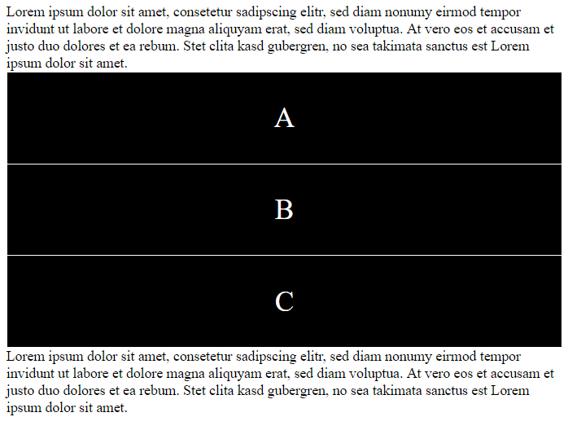

# README

## `display`-Eigenschaft

Die `display`-Eigenschaft legt fest, ob und wie ein HTML-Element angezeigt wird. Jedes HTML-Element hat dabei einen Standardwert. Der Standardwert für die meisten Elemente ist entweder `block` oder `inline`.

### Display: block

Ein Block-Element startet im Layout auf einer neuen Linie und nimmt die komplette verfügbare Breite ein \(es dehnt sich dabei links und rechts soweit aus, wie es kann\).

**Oder**: Wenn eine fixe Breite oder Höhe eingegeben wurde, nimmt es genau die angegebene Grösse an.

Block-Elemente sind unter anderem:

* **`<div>`**
* `<h1> - <h6>`
* `<p>`
* `<form>`
* `<header>`
* `<footer>`
* `<section>`

```markup
Lorem ipsum dolor sit amet, consetetur sadipscing elitr, sed diam nonumy eirmod tempor invidunt ut labore et dolore magna aliquyam erat, sed diam voluptua. At vero eos et accusam et justo duo dolores et ea rebum. Stet clita kasd gubergren, no sea takimata sanctus est Lorem ipsum dolor sit amet.
<div>A</div>
<div>B</div>
<div>C</div>
Lorem ipsum dolor sit amet, consetetur sadipscing elitr, sed diam nonumy eirmod tempor invidunt ut labore et dolore magna aliquyam erat, sed diam voluptua. At vero eos et accusam et justo duo dolores et ea rebum. Stet clita kasd gubergren, no sea takimata sanctus est Lorem ipsum dolor sit amet.
```

```css
div {
  display: block;
}
```

[https://codepen.io/anon/pen/MOvXKm](https://codepen.io/anon/pen/MOvXKm)



### Display: inline

Ein Inline-Element startet nicht zwingend auf einer neuen Linie und nimmt nur soviel Platz ein, wie sein Inhalt benötigt.

Inline-Elemente sind unter anderem:

* `<span>`
* `<a>`
* ``

Einem `inline`-Element kann keine Höhe oder Breite zugewiesen werden. Diese Eigenschaften werden ignoriert. Die Eigenschaften `margin` und `padding` werden zwar interpretiert, haben jedoch keinen Einfluss auf den Abstand zu anderen Elementen.

```css
div {
  display: inline;
}
```

[https://codepen.io/anon/pen/MOvXKm](https://codepen.io/anon/pen/MOvXKm)


### Display: inline-block

Ein Inline-Block-Element ist sehr ähnlich zum Inline-Element. So können die Elemente nebeneinander positioniert werden, jedoch werden zusätzlich auch die Höhe und Breite interpretiert und die Eigenschaften `margin` und `padding` haben Einfluss auf den Abstand zu anderen Elementen.

```css
div {
  display: inline-block;
}
```

[https://codepen.io/anon/pen/MOvXKm](https://codepen.io/anon/pen/MOvXKm)


### Display: none

Zusätzlich zu den vielen verschiedenen Anzeigearten erlaubt der Wert `none` es, ein Element gänzlich auszublenden; wenn `none` verwendet wird, werden auch alle Unterelemente ausgeblendet. Das Dokument wird so dargestellt, als ob das Element nicht existieren würde.

## Aufgabe

Füge neben der ersten Person im Dokument noch eine zweite Person mit Unterschrift ein. Schaue, dass die beiden Unterschriften einen genügend grossen Abstand zueinander haben.


Hier findest Du die Rechnung noch als [PDF](https://github.com/johannesE/modul-101/tree/7ef76a9c9f706911092af198dd248f9a2832f329/Tag%202/05%20Inline%20und%20Block/src/Rechnungsvorlage.pdf).

