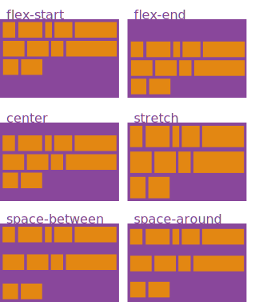

# Der Flex-Container

Die folgende Liste von Eigenschaften für den Flex-Container ist nicht abschliessend, zeigt jedoch die wichtigten Elemente.


## Flex-Container: `display`

Um zu definieren, dass es sich bei einem Element um einen Flex-Container handelt, kann einem Element die Eigenschaft `display: flex` zugewiesen werden. Damit wird das Flex-Modul für den Flex-Container aktiviert.

```css
.container {
    display: flex;
}
```

## Flex-Container: `flex-direction`

Mit der `flex-direction`-Eigenschaft kann definiert werden, ob sich die Elemente horizontal oder vertikal ausrichten sollen \(=Ausrichtungsachse\). Sprich, ob man mit einem Zeilenlayout oder einem Spaltenlayout arbeiten möchte:


```css
.container {
  flex-direction: row; /* oder: row-reverse | column | column-reverse */
}
```

| Value | Beschreibung |
| :--- | :--- |
| row \(standard\) | links nach rechts |
| row-reverse | rechts nach links |
| column | oben nach unten |
| column-reverse | unten nach oben |

## Flex-Container: `flex-wrap`

Standardmässig passt der Flex-Container sämtliche Flex-Items in eine Linie ein. Dieses Verhalten kann jedoch mit der `flex-wrap`-Eigenschaft angepasst werden.


```css
.container {
  flex-wrap: nowrap; /* oder: wrap | wrap-reverse */
}
```

| Value | Beschreibung |
| :--- | :--- |
| nowrap \(standard\) | Alle Items in einer Linie |
| wrap | Die Items werden auf mehrere Linien aufgeteilt, von oben nach unten |
| wrap-reverse | Die Items werden auf mehrere Linien aufgeteilt, von unten nach oben |

## Flex-Container: `justify-content`

Diese Eigenschaft definiert die Ausrichtung der Items einer einer Linie. Ebenfalls wird definiert, was mit dem restlichen Platz gemacht wird.


```css
.container {
  justify-content: flex-start; /* oder: flex-end | center | space-between | space-around | space-evenly */
}
```

| Value | Beschreibung |
| :--- | :--- |
| flex-start \(standard\) | Items werden am Anfang der Linie positioniert |
| flex-end | Items werden ans Ende der Linie positioniert |
| center | Items werden ins Zentrum der Linie positioniert |
| space-between | Items werden gleichmässig auf der Linie verteilt; das erste Item ist am Anfang, das letzte Element am Ende |
| space-around | Items werden gleichmässig auf der Linie verteilt; sämtliche Items haben rechts und links den gleichen Abstand; dies führt dazu, dass der Abstand am Anfang und am Ende nur halb so gross ist. |
| space-evenly | Dito `space-around`, nur dass der ungleiche Abstand am Anfang und Ende der Items durch Flexbox kompensiert wird |

## Flex-Container: `align-content`

Diese Eigenschaft definiert die Ausrichtung der Linien entlang der vertikalen Achse \(`cross-axis`\). Ebenfalls wird definiert, was mit dem restlichen Platz gemacht wird. Somit ist diese Eigenschaft die vertikale Schwester von `justify-content`.



```css
.container {
  align-content: stretch; /* oder: flex-start | flex-end | center | space-between | space-around */
}
```

| Value | Beschreibung |
| :--- | :--- |
| flex-start | Linien werden am Anfang des Containers angezeigt |
| flex-end | Linien werden am Ende des Containers angezeigt |
| center | Linien werden im Zentrum des Containers angezeigt |
| space-between | Linien werden gleichmässig im Container verteilt; die erste Linie ist am Anfang, die letzte Linie am Ende |
| space-around | Linien werden gleichmässig im Container verteilt, mit gleichem Abstand dazwischen |
| stretch  \(standard\) | Die Höhe der Linien wird so definiert, dass sämtliche Linien gleich hoch sind und den ganzen Platz ausnutzen |

