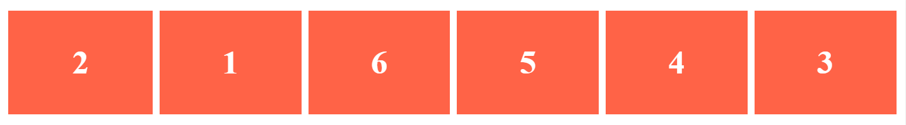

# Aufgabe Boxen

## Aufgabe 1





Lade die Dateien `index.html` und `style.css` bei dir lokal herunter. Ergänze den Flex-Container mit den nötigen CSS-Deklarationen \(an der Stelle mit dem Vermerk `Aufgabe 1`\), damit das Ergebnis bei den aufgeführten Bildschirmbreiten so aussieht:

### Bildschirm breit

### Bildschirm schmal

## Aufgabe 2

Ergänze die Flex-Items mit den nötigen CSS-Deklarationen \(an der Stelle mit dem Vermerk `Aufgabe 2`\), damit das Ergebnis bei den aufgeführten Bildschirmbreiten so aussieht:

### Bildschirm breit

### Bildschirm schmal

