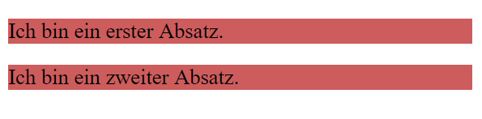
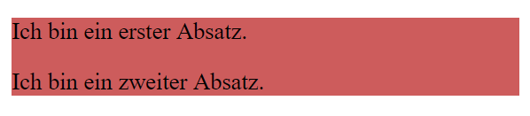

# 01 Dokumentenstruktur

Um Elemente innerhalb eines Dokuments besser zu strukturieren, hat HTML das Strukturelement `<div>` vorgesehen. Das `<div>`-Element (Document Division Element) ist ein generischer Container für Inhalte, der keine eigene Bedeutung hat, ausser dass er Elemente zusammenfasst, z.B. um sie zu stylen (mit Hilfe des `class` oder `id` Attributs).

Beispiel: Wir möchten, dass die folgenden Absätze mit einer Hintergrundfarbe hinterlegt sind, ohne einen weissen Absand dazwischen zu haben.

```html
<p>Ich bin ein erster Absatz.</p>
<p>Ich bin ein zweiter Absatz.</p>
```

```css
p {
    background-color: indianred;
}
```

Dies entspricht jedoch nicht unserem gewünschten Ergebnis:



Um das Ziel zu erreichen, umklammern wir die beiden Absätze mit einem `<div>`-Strukturelement und stylen das `<div>`-Element:

```html
<div class="red">
    <p>Ich bin ein erster Absatz.</p>
    <p>Ich bin ein zweiter Absatz.</p>
</div>
```

```css
.red {
    background-color: indianred;
}
```



## Semantische Elemente

Semtantische Elemente sind gleichbedeutend wie `<div>`-Strukturelemente, sie haben aber einen vordefinierten Anwendungszweck.

So sollte das `<header>`-Element ausschliesslich für die Strukturierung des Kopfbereichs von Sektionen und Websites verwendet werden.

| Semantisches Element | Beschreibung                                                                                       | Möglicher Inhalt                         |
| -------------------- | -------------------------------------------------------------------------------------------------- | ---------------------------------------- |
| `<header>`           | Das Element beinhaltet Kopfelemente der Website oder einer Sektion.                                | Navigation, Logo, Suchfeld               |
| `<nav>`              | Das Element beinhaltet eine Navigation.                                                            | Navigation                               |
| `<main>`             | Das Element beinhaltet den Hauptinhalt der Website.                                                | Hauptinhalt                              |
| `<section>`          | Das Element unterteilt ein Dokument in mehrere allgemeine Sektionen.                               | <p>Produkte, <br>News</p>                |
| `<article>`          | Eine Sektion kann mehrere Artikel umfassen.                                                        | <p>Ein Produkt, <br>ein News-Beitrag</p> |
| `<aside>`            | Das Element beinhaltet Informationen, welche mit dem Hauptinhalt der Website in Verbindung stehen. | Sidebar                                  |
| `<footer>`           | Das Element beinhaltet Fusselemente der Website oder einer Sektion.                                | Copyright, nützliche Links               |

Die semantischen Elemente erleichtern vorallem die Human-Readability des HTML- und CSS-Codes.

**Darum gilt:** Generische `<div>`-Elemente sollten nur genutzt werden, wenn kein semantisches Element geeignet ist.

Schau dazu im Browser die HTML-Struktur einer Beispielseite an: \
[der-informationsdesigner.de/agentur-blog/allgemein/was-ist-webdesign](https://www.der-informationsdesigner.de/agentur-blog/allgemein/was-ist-webdesign/)

## 🛠️ Aufgabe


Unterteile deine Rechnung mit den entsprechenden semantischen Elementen in einen Kopf-, Haupt- und Fussbereich.&#x20;

Schreibe das CSS deiner Rechnung so um, dass möglichst kein `margin` oder `padding` mehr einem `<p>`, `` oder `<table>`-Tag zugewiesen ist, sondern den ensprechenden semantischen Elementen oder \<div> Containern.
