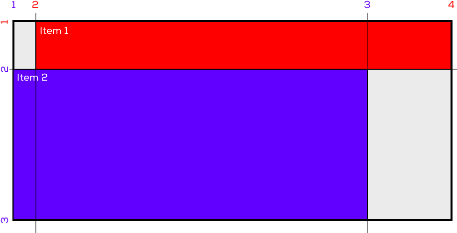
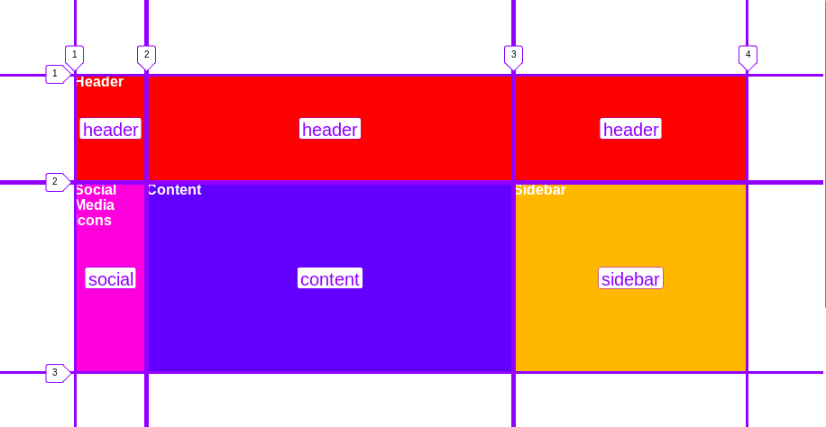

# 03 Platzierung

Elemente können in einem Grid frei platziert werden.

## `grid-*-start` und `grid-*-end`

Eine Variante um Elemente zu platzieren ist die Defintion via `grid-column-start` und `grid-column-end` bzw. deren Pendants `grid-row-start` und `grid-row-end`.

Dabei werden alle Spalten und Zeilen beginnend mit `1` nummeriert.



Für ein Element wird dann jeweils der Start und Endpunkt in CSS angegeben:

```markup
<div class="container">
  <div class="item-1">Item 1</div>
  <div class="item-2">Item 2</div>
</div>
```

```css
.item-1 {
  grid-column-start: 2;
  grid-column-end:   4;

  grid-row-start: 1;
  grid-row-end:   2;
}


.item-2 {
  grid-column-start: 1;
  grid-column-end:   3;

  grid-row-start: 2;
  grid-row-end:   3;
}
```

Siehe [https://codepen.io/anon/pen/EbWMyK](https://codepen.io/anon/pen/EbWMyK)

Mit diesen vier Eigenschaften kannst du die Elemente beliebig platzieren. Es gibt noch diverse andere Schreibweisen für die `grid-column` und `grid-row` Eigenschaften, die etwas kürzer sind:

```css
.item-1 {
  grid-column: 2 / 4; /* Entspricht grid-column-start: 2; grid-column-end: 3; */
  grid-row:    1 / 2; /* Entspricht grid-column-start: 1; grid-column-end: 2; */
}
```

Eine Übersicht aller verfügbarer Varianten findest du unter [https://css-tricks.com/snippets/css/complete-guide-grid/](https://css-tricks.com/snippets/css/complete-guide-grid/).

## `grid-area`

Für komplexere Grids kann die `grid-area` Property verwendet werden. Mit `grid-area` können bestimmten Bereichen im Grid spezifische Namen vergeben werden. Dies vereinfacht das Platzieren einzelner Elemente.


In unserem Beispiel gibt es vier Areas: `header`, `social`, `content` und `sidebar`. Die Namen dieser Areas kannst du frei wählen, sie sollten aus Kleinbuchstaben bestehen.

Zuerst wird im Container das Grid definiert:

```css
.container {
    display: grid;
    grid-template-columns: 80px auto 260px;
    grid-template-rows:   120px auto;
}
```

Jetzt kann das Grid mit `grid-template-areas` aufgeteilt werden. Für jede Zeile muss eine Definition erstellt werden. Jede Spalte muss einen Namen erhalten. Spalten und Zeilen mit gleichem Namen gelten als `Area`.

```css
.container {
    display: grid;
    grid-template-columns: 80px auto 260px;
    grid-template-rows:   120px auto;

    /** 
     * Die Kommentare sind nur zur besseren Veranschaulichung
     * der Struktur vorhanden und werden zur eigentlichen
     * Definition natürlich nicht benötigt.
     */
    grid-template-areas: 
        /* S1 */   /* S2 */   /* S3 */
        "header    header     header"    /* Zeile 1 */
        "social    content    sidebar"   /* Zeile 2 */ 
    ;
}
```

Elemente im Grid lassen sich jetzt ganz einfach mit `grid-area` platzieren.

```markup
<div class="container">
  <header>Header</header>
  <main>Content</main>
  <aside>Sidebar</aside>
  <div class="social">Social Media Icons</div>
</div>
```

```css
header {
    grid-area: header;
}
main {
    grid-area: content;
}
aside {
    grid-area: sidebar;
}
.social {
    grid-area: social;
}
```

Siehe [https://codepen.io/anon/pen/ooZVoG](https://codepen.io/anon/pen/ooZVoG).

**Tipp:** Ab Firefox Version 57 findest du in den Entwicklertools unter `Inspect -> Layout` den CSS Grid Inspector, der dir beim Arbeiten mit Grids helfen kann:

 

