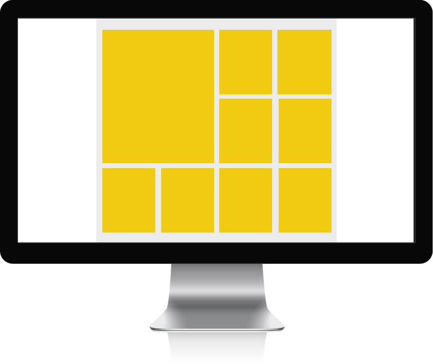
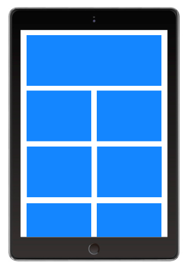
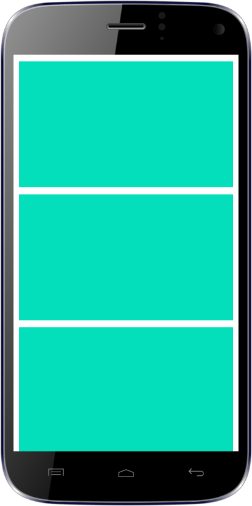

# 03 Aufgabe


## Desktop-Layout

Erstelle ein CSS-Grid für folgende Startseite des Blogs «blog.ict-bz.ch». Jedes Rechteck wird später mit einem Blog-Artikel mit Bild, Überschrift und Text ersetzt. Vorerst konzentrieren wir uns jedoch nur aufs Layout.

1. Der Container ist `1200px` breit und zentriert.
2. Es werden `9` Elemente platziert.
3. Die Elemente werden auf vier `1fr` breite Spalten verteilt. `1fr` bedeuetet `1 fraction`, also jeweils ein "Bruchteil" des verfügbaren Platzes \(gleiches Prinzip wie bei `flex-grow`\).
4. Die Elemente werden auf drei `400px` hohe Zeilen verteilt.
5. Der Abstand zwischen den einzelnen Elementen beträgt `40px`.
6. Der neuste Artikel wird immer etwas grösser über zwei Spalten und zwei Zeilen dargestellt.

**Tipp:** Für dieses Layout benötigst du _keine_ `grid-area` Regeln. Es geht deutlich einfacher!



## Responsives Layout

1. Sobald für die `1200px` des Containers kein Platz mehr auf dem Bildschirm ist, soll der Container immer `100%` breit sein.
2. Die einzelnen Elemente werden jetzt auf `zwei Spalten` verteilt.
3. Das erste Element ist immer noch `zwei Spalten` breit, aber nur noch `eine Zeile` hoch.



1. Wenn für die einzelnen Elemente nicht mehr mindestens `440px` Breite zur Verfügung stehen, sollen alle Elemente über `100%` des Bildschirms in einer Spalte angezeigt werden.



## Zusatzaufgabe


1. Wie kannst du folgende Regel weniger umständlich schreiben?

```css
.container {
    grid-template-columns: 80px 80px 80px 80px 80px 80px 80px;
    grid-template-rows: 200px 200px 200px auto 200px 200px 200px 200px 200px 200px;   
}
```

1. Versuche dein Layout aus der CSS Grid Übung für die Anzeige auf verschiedenen Bildschirmgrössen zu optimieren.
2. Kannst du das gleiche responsive Layout mit `flexbox` umsetzen?

