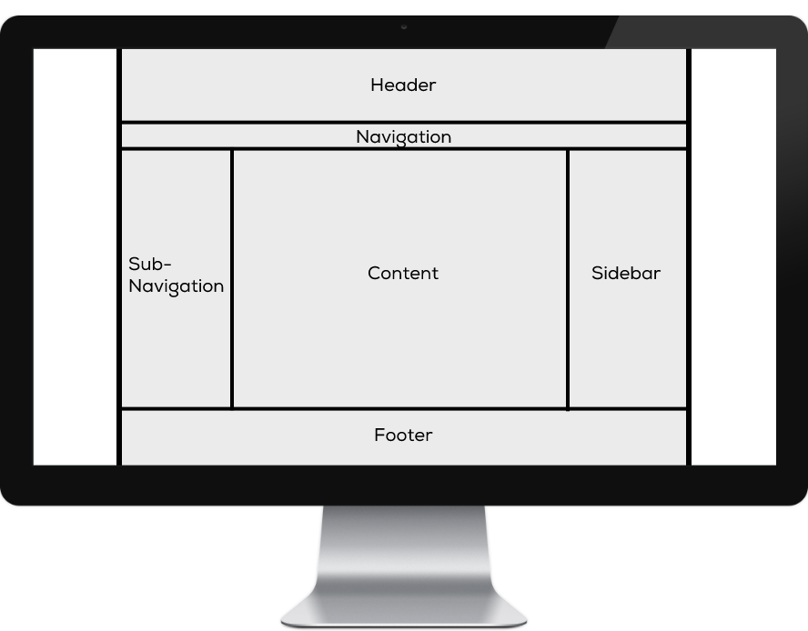

# 🛠️ Grid Aufgabe

Du weisst jetzt, wie man ein Layout mit CSS Grids definiert. Nutze dein Wissen um folgendes Layout in CSS nachzubauen.

## Aufgabenstellung


Setze das unten dargestellte Layout mit einem CSS Grid um.&#x20;



Erstelle dazu ein neues Verzeichnis `grid-aufgabe` mit den Dateien `layout.html` und `styles.css`.&#x20;

Die Datei `layout.html`  soll das [HTML-Grundgerüst](../../tag-1/03-html/04-html-dokument.md#aufbau-eines-html-dokumentes) enthalten, dazu das [CSS verlinken](../../tag-1/04-css/02-einbindung.md#css-datei-einbinden) und die [semantischen Struktur-Elemente](../../tag-1/03-html/07-struktur-semantische-tags.md#semantische-strukturelemente) für das obige Layout im `<body>` enthalten: \<header>, \<nav class="main-nav">, \<nav class="sub-nav">, \<main>, \<aside> und `<footer>`.

In die Datei `styles.css` kannst du als Starthilfe schon mal dies einfügen:

```css
body {
    font-family: Arial, Helvetica, sans-serif;
    margin: 0;
}
.container {
    background: lightgrey;
    margin: 0 auto;
    max-width: 1100px;
    min-height: 100vh;

    /* Grid */
    display: grid;
    grid-template-columns: /* ... */;
    grid-template-rows:    /* ... */;
}
header {
    grid-area: /* ... */;
    background-color: lightgray;
}
```

Erstelle nun das Grid gemäss obiger Grafik.

Danach kannst du noch folgende Fragen beantworten:&#x20;

* Was bewirkt `body { margin: 0; }`?
* Was bedeutet `.container { margin: 0 auto; }` und was bewirkt es?
* Was bedeutet `min-height: 100vh` und was bewirkt es?
* Füge zwischen allen Zeilen und Spalten einen Abstand von `20px` ein.
* Füge eine horizontale Navigation an der entsprechenden Stelle ins Layout ein. Nutze dazu Flexbox, um die Menü-Items zu verteilen.&#x20;
