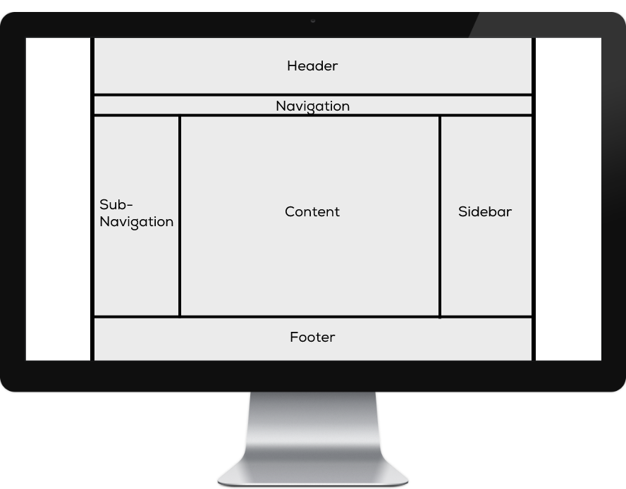

# 🛠 Grid Aufgabe

Du weisst jetzt, wie man ein Layout mit CSS Grids definiert. Nutze dein Wissen um folgendes Layout in CSS nachzubauen.

Als Starthilfe wird dir folgendes CSS für deinen Container vorgegeben.

```css
body {
    margin: 0;
}
.container {
    display: grid;
    background: lightgrey;
    margin: 0 auto;
    width: 100%;
    max-width: 1100px;
    height: 100vh;

    grid-template-columns: /* ... */;
    grid-template-rows:    /* ... */;
}
```

## Aufgabenstellung


1. Erstelle die Dateien layout.html das unten dargestellte Layout mit einem CSS Grid.
2. Was bewirkt `body { margin: 0; }`?
3. Was bedeutet `margin: 0 auto` und was bewirkt es?
4. Was bedeutet `height: 100vh` und was bewirkt es?
5. Füge zwischen allen Zeilen und Spalten einen Abstand von `80px` ein.
6. Füge eine horizontale Navigation an der entsprechenden Stelle ins Layout ein.


