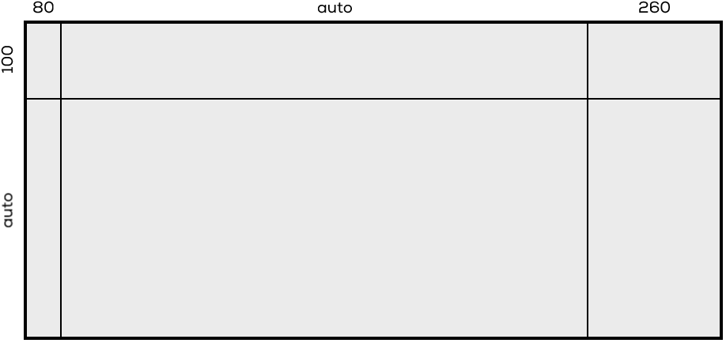

# 02 Definition

## Grids in CSS definieren

Wir möchten folgendes Grid in CSS umsetzen. Dazu kann wie folgt vorgegangen werden:



## Container definieren

Als aller erstes muss ein Container definiert werden:

```markup
<div class="container">
    <!-- Hier werden die Inhalte eingefügt -->
</div>
```

In CSS muss dessen `display` Property auf `grid` gesetzt werden.

```css
.container {
    display: grid;
}
```

## Spalten definieren

Um die Spalten zu definieren, kann die `grid-template-columns` Property verwendet werden.

In userem Beispiel wird die erste Spalte auf `80px` und die dritte Spalte auf `260px` fixiert. Die zweite Spalte soll immer den restlichen Platz ausfüllen \(`auto`\).

```css
.container {
    display: grid;
    grid-template-columns: 80px auto 260px;
}
```

## Zeilen definieren

Um die Zeilen zu definieren, kann die `grid-template-rows` Property verwendet werden.

In userem Beispiel wird die erste Zeile auf `100px` fixiert. Die zweite Zeile soll immer den restlichen Platz ausfüllen \(`auto`\).

```css
.container {
    display: grid;
    grid-template-columns: 80px auto 260px;
    grid-template-rows:   120px auto;
}
```

## Inhalte einfügen

Wenn du jetzt sechs Elemente in deinen Container einfügst, werden diese automatisch in deinem Grid platziert.

```markup
<div class="container">
  <div>A</div>
  <div>B</div>
  <div>C</div>
  <div>D</div>
  <div>E</div>
  <div>F</div>
</div>
```

Siehe [https://codepen.io/anon/pen/ZaePGz](https://codepen.io/anon/pen/ZaePGz).

