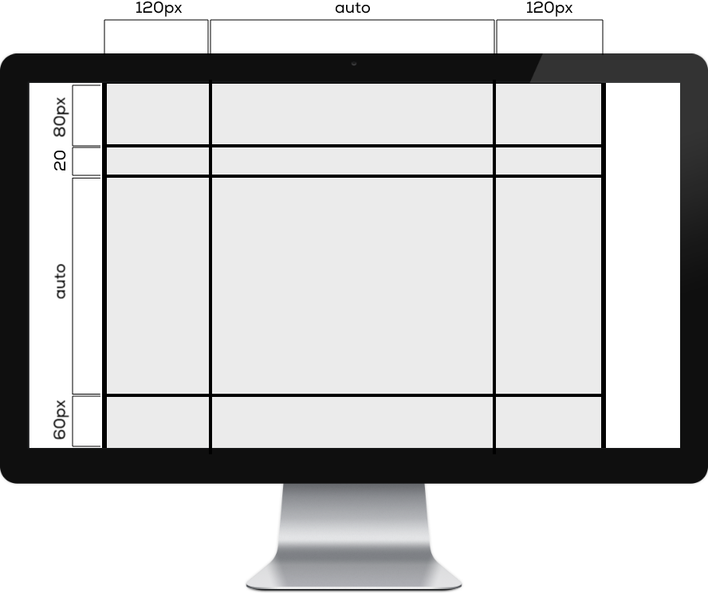
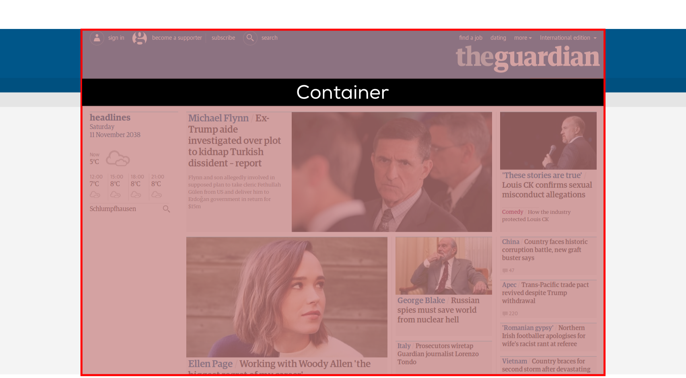
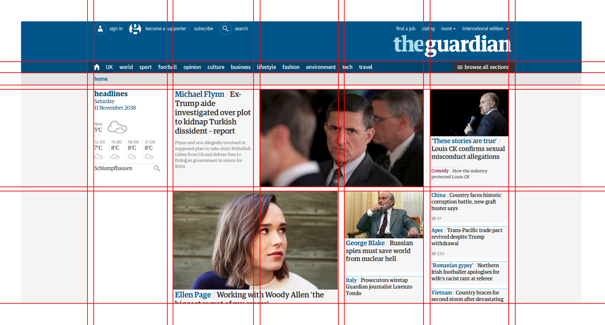

# Konzept

## CSS Grids für Layouts

Das `CSS Grid Layout` Modul von CSS dient dazu, das Definieren von gridbasierten Layouts zu vereinfachen.

## Layouts in CSS

Die Methoden zur Definition von Layouts in CSS haben in den letzten Jahren einen stetigen Wandel durchlebt. Dabei wurden folgende Varianten verwendet:

* Tabellen
* Floats
* Grids und Flexbox

Abhängig des Alters eines Projekts wirst du eine der drei Varianten vorfinden. Wir konzentrieren uns in diesem ÜK auf die modernste Methode mit Grids und Flexbox.

## Was ist ein Grid?

Das Grid ist ein Raster, an dem sich alle Elemente in einem Layout ausrichten.

### Container

Grundlage für jedes Grid ist der `Container`.

Der Container fixiert die Breite des Layouts. Die Höhe kann ebenfalls fixiert werden, wird aber üblicherweise flexibel gelassen.&#x20;

### Columns and Rows

Im Container werden beliebig viele Spalten (`Columns`) und Zeilen (`Rows`) definiert. Alle Inhaltselemente richten sich an diesem Raster aus.

### Gaps

Zwischenräume zwischen `Columns` und `Rows` bezeichnet man als `Gaps`.

## Beispiel: theguardian.com

### Container

### Columns

### Rows

### Grid

