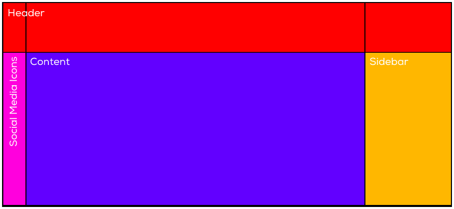
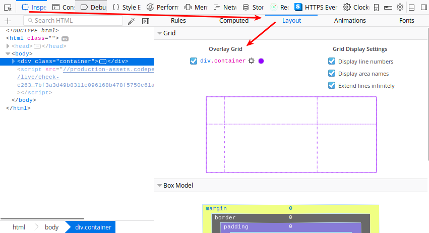
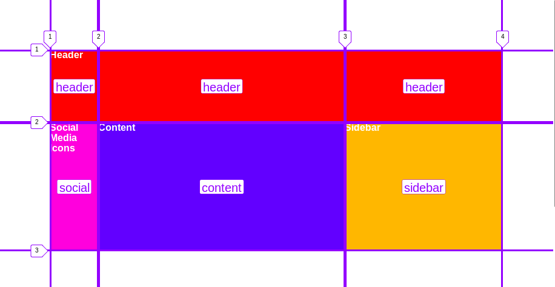
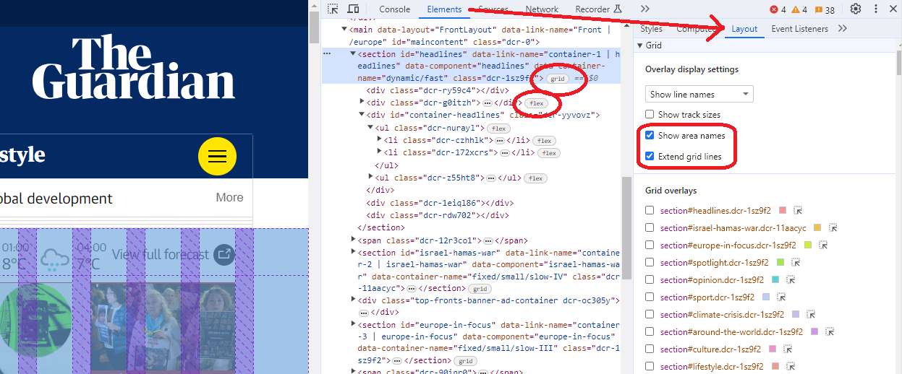

# Platzierung

Elemente können in einem Grid frei platziert werden. Dazu werden Bereiche (areas) definiert:&#x20;

### `grid-template-areas`

Mit `grid-template-areas` können bestimmten Bereichen im Grid spezifische Namen vergeben werden.&#x20;



In unserem Beispiel gibt es vier Areas: `header`, `social`, `content` und `sidebar`. Die Namen dieser Areas kannst du frei wählen, sie sollten aus Kleinbuchstaben bestehen.

Zuerst wird im Container das Grid definiert:

```css
.container {
    display: grid;
    grid-template-columns: 80px auto 260px;
    grid-template-rows:   120px auto;
}
```

Jetzt kann das Grid mit `grid-template-areas` aufgeteilt werden. Für jede Zeile muss eine Definition erstellt werden. Jede Spalte muss einen Namen erhalten. Spalten und Zeilen mit gleichem Namen gelten als `Area`.

```css
.container {
    display: grid;
    grid-template-columns: 80px auto 260px;
    grid-template-rows:   120px auto;

    /** 
     * Die Kommentare sind nur zur besseren Veranschaulichung
     * der Struktur vorhanden und werden zur eigentlichen
     * Definition natürlich nicht benötigt.
     */
    grid-template-areas: 
        /* S1 */   /* S2 */   /* S3 */
        "header    header     header"    /* Zeile 1 */
        "social    content    sidebar"   /* Zeile 2 */ 
    ;
}
```

### `grid-area`

Elemente im Grid lassen sich jetzt ganz einfach mit `grid-area` platzieren.

```markup
<div class="container">
  <header>Header</header>
  <main>Content</main>
  <aside>Sidebar</aside>
  <div class="social">Social Media Icons</div>
</div>
```

```css
header {
    grid-area: header;
}
main {
    grid-area: content;
}
aside {
    grid-area: sidebar;
}
.social {
    grid-area: social;
}
```

Siehe [https://codepen.io/anon/pen/ooZVoG](https://codepen.io/anon/pen/ooZVoG).

### Unterstützung in den Browser-DevTools (F12)

In den Entwicklertools findest du unter `Inspect -> Layout` (Firefox) bzw. `Elements -> Layout` (Chrome) den Grid Inspector, der dir beim Arbeiten mit Grids helfen kann:

 

<figure><figcaption><p>Grids und Flexboxen sind in Chrome leicht zu finden.</p></figcaption></figure>
