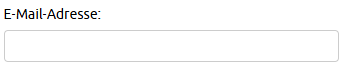
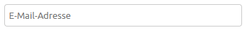
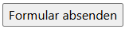

# Formulare

Unter [w3schools.com/html/html\_forms.asp](https://www.w3schools.com/html/html_forms.asp) findest du eine Übersicht wichtiger Elemente von Formularen und die Möglichkeit, es selber auszuprobieren. Nutze auch `Next >` oben rechts.&#x20;

## Form-Tag

Alle Elemente müssen in einem `<form>`-Tag eingefasst sein.

```html
<form action="ziel.php" method="post">
    <label for="feld1">Bezeichnung</label>
    <input type="text" name="feld" id="feld1">
</form>
```

Beim Absenden eines Formulars werden die Daten aller Elemente innerhalb des `<form>`-Tags an die in **`action`** definierte URL versendet. \
**Achtung:** Felder, welche ausserhalb des `<form>`-Containers stehen, werden **nicht** mitgesendet.

Das Attribut method kann den Wert "get" oder "post" enthalten.&#x20;

* **method="post" (meist empfohlen)** schickt die Formulardaten im Hintergrund an die Zieladresse. Die Datenmenge ist grundsätzlich nicht limitiert und vertrauliche Daten sind bei einer verschlüsselten Verbindung (https) geschützt.&#x20;
* **method="get" (meist nicht empfohlen)** hängt alle Formulardaten hinten an die URL an und schickt sie so mit. Die Datenmenge ist auf ca. 2000 Zeichen limitiert, also recht klein. Vertrauliche Daten sollten NIE mit "get" verschickt werden, weil sie in der URL für alle transparent lesbar sind.

In diesem Kurs nutzen wir zum Testen das Ziel [https://formlog.ict-bz.ch/](https://formlog.ict-bz.ch/). Deine Daten werden dort 7 Tage gespeichert und danach gelöscht. Die Daten müssen mit der **Methode "post"** geschickt werden, "get" funktioniert nicht.

## Steuerelemente

### Input-Typen

In HTML werden die meisten Formularfelder mit dem `input` Tag deklariert. Mit dem `type` Attribut können verschiedene Typen spezifiziert werden. Unter W3School.com findest du alle [Input-Typen](https://www.w3schools.com/html/html_form_input_types.asp) mit Beispielen.&#x20;

**Jedes Feld muss zwingend ein `name` Attribut haben**, sonst wird das Feld beim Versenden nicht mitgeschickt.

```html
<input type="text" name="address">
<input type="email" name="mail">
<input type="checkbox" id="coffee" name="coffee"><label for="coffee">Kaffee</label>
```

### Weitere Form-Elemente

Zudem gibt es mehrzeilige Textfelder (`textarea`), Dropdowns (`select`, `option`) und Schaltflächen (`buttons`). Unter W3School.com findest du diese [Form-Elemente](https://www.w3schools.com/html/html_form_elements.asp) mit Beispielen.&#x20;

```html
<textarea name="remarks" rows="10" cols="4"></textarea>

<select name="anrede">
    <option value="Frau">Frau</option>
    <option value="Herr">Herr</option>
</select>

<button type="submit" name="submit">Formular absenden</button>
```

## Labels vs. Placeholder

### Labels

Ein alleinstehendes, unbeschriftetes Inputfeld ist für den Besucher nicht brauchbar. Was muss er darin eintragen? Um den Feldern einen Beschreibungstext zu geben, können wir das `label` Tag verwenden.

<div align="left"><figure><figcaption></figcaption></figure></div>

* **Vorteil:** Bei Eingabe ist die Feldbezeichnung weiter sichtbar.&#x20;
* **Nachteil:** Das Formular braucht etwas mehr Platz.&#x20;

```html
<label for="email1">E-Mail-Adresse</label><br>
<input type="email" name="mail" id="email1"><br>
```

Das `for` Attribut im Label verweist auf die `id` des Input-Elements. \
Bei einem Klick auf das Label wird der Cursor automatisch ins zugehörige Feld platziert.

Diese Zuordnung ist zudem für Screenreader wichtig, da er nur so weiss, welches Label vorgelesen werden soll, wenn der Cursor ins Feld platziert wird.

### Placeholder

Alternatif kann innerhalb des Feldes ein Placeholder eingefügt werden. Dieser verschwindet, sobald etwas ins Feld geschrieben wird.&#x20;

<div align="left"><figure><figcaption></figcaption></figure></div>

* **Vorteil:** Das Formular ist kompakter.&#x20;
* **Nachteil:** Bei Eingabe ist die Feldbezeichnung nicht mehr sichtbar.&#x20;

```html
<input type="email" name="mail" placeholder="E-Mail-Adresse">
```

## Formular abschicken: Submit-Button

Mit einem `submit`-Button kann das Formular versendet werden. Bei einem Klick darauf wird der Versand der Formulardaten ausgelöst.

<div align="left"><figure><figcaption></figcaption></figure></div>

Es gibt zwei gültige Schreibwesen für einen Submit-Button:

```html
<form action="ziel.php" method="post">

    <label for="feld1">Bezeichnung</label>
    <input type="text" name="feld" id="feld1">

    <input type="submit" name="submit" value="Formular absenden">
    <!-- oder -->
    <button type="submit" name="submit">Formular absenden</button>

</form>
```
