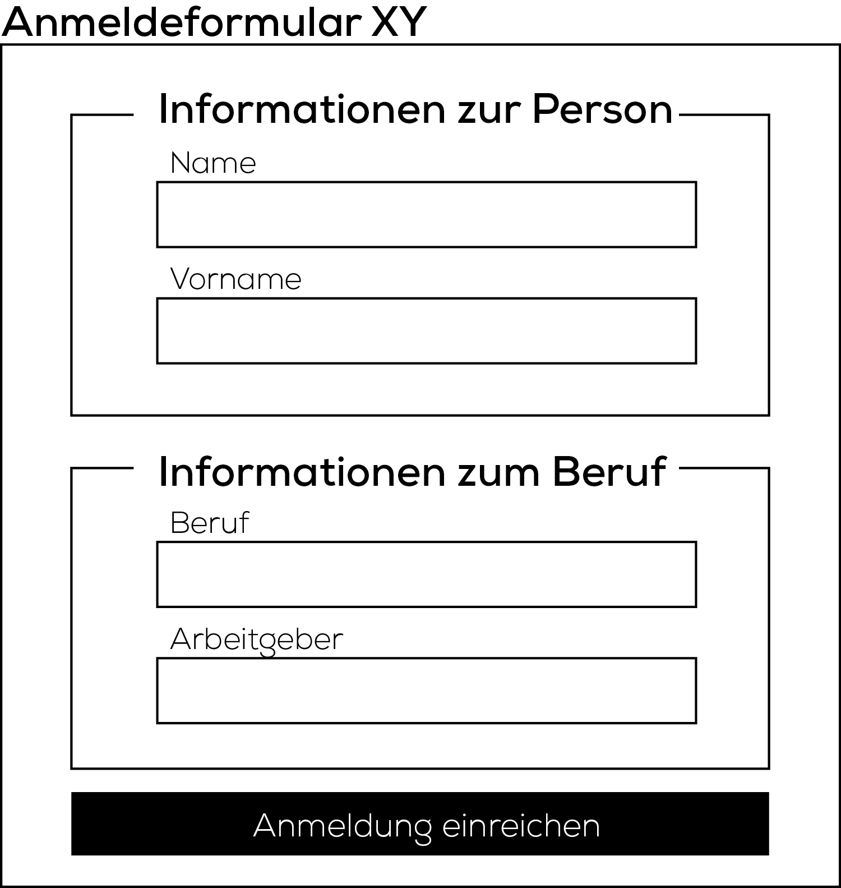

# Informationsgruppierung

Bei umfangreichen Formularen können Formularfelder in zusammengehörige Gruppen zusammengefasst werden. Dies erhöht die Bedienerfreundlichkeit.&#x20;

Formularelemente lassen sich in drei hierarchische Stufen unterteilen:

1. Formular
2. Formularfeld-Gruppe (Fieldset)
3. Formularfelder (Textfeld, Checkbox, Radio-Box...)

## Formularfeld-Gruppen (Fieldset)

Das Tag `fieldset` ermöglicht es dem Benutzer die Formularfelder in Sets/Gruppen zu strukturieren. Ausschlaggebend für die Unterteilung ist die thematische Zusammengehörigkeit der einzelnen Felder.

Die Formularfeld-Gruppen erleichtern zum einen die Navigation innerhalb des Dokuments und erhöhen gleichzeitig die Accessability der Seite.&#x20;

Accessability/Barrierefreiheit: Kommunikation in einer Weise, welche von Menschen mit Behinderung und von älteren Menschen in gleicher Weise genutzt werden kann wie von Menschen ohne Behinderung.

```markup
<form action="https://formlog.ict-bz.ch/" method="post">

    <fieldset>
        <legend>Informationen zur Person</legend>

        <label for="firstname">Vorname</label>
        <input type="text" id="firstname" name="firstname">

        <label for="lastname">Nachname</label>
        <input type="text" id="lastname" name="lastname">

    </fieldset>

    <fieldset>
        <legend>Informationen zum Beruf</legend>

        <label for="work">Beruf</label>
        <input type="text" id="work" name="work">

        <label for="workplace">Arbeitgeber</label>
        <input type="text" id="workplace" name="workplace">

    </fieldset>

    <button type="submit" name="form-submit">Anmeldung einreichen</button>

</form>
```

Als kleine Illustration:

<div align="left"></div>
