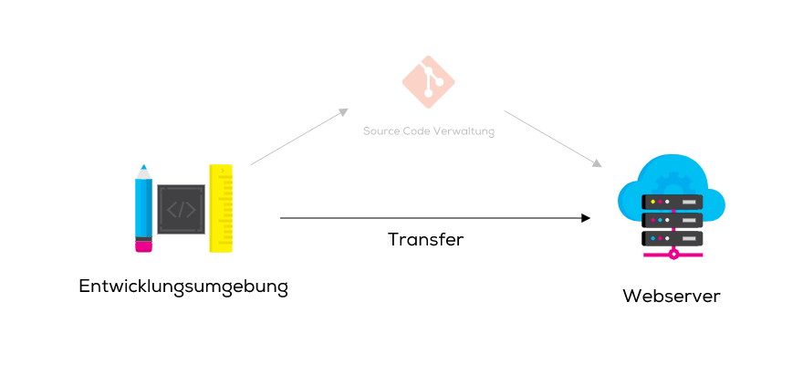

# 04 Veröffentlichen

Als **Veröffentlichung** oder **Deployment** einer Website bezeichnet man den Vorgang, um den neusten Entwicklungsstand einer Website für die Öffentlichkeit zugänglich zu machen.

Methoden zur Veröffentlichung von Websites gibt es wie Sand am Meer: Von der einfachen manuellen Methode bis zum vollautomatischen Testing mit anschliessender Veröffentlichung auf mehrere Server gleichzeitig.

Im Prinzip sind alle Methoden gleich:

* Der Code wird von der lokalen Entwicklungsumgebung (von deiner Arbeitsstation) auf einen Webserver geladen.&#x20;
* Der Webserver ist über das Internet zugänglich und stellt Daten **24/7** bereit. Üblicherweise nimmst du dafür die Dienstleistungen eines **Hostinganbieters** in Anspruch, der diesen Webserver für dich betreibt und betreut.&#x20;
* Im Idealfall wird eine Source Code Verwaltung (wie z. B. [`git`](https://git-scm.com/)) dazwischen geschaltet.&#x20;
* Für unser Anwendungsfall genügt ein direktes und manuelles Veröffentlichen.&#x20;

**Probleme mit absoluten Links:** Falls Links (zu Bildern, CSS etc.) nicht relativ, sondern absolut eingefügt wurden, werden diese nach dem Veröffentlichen nicht mehr funktionieren. Bilder, CSS und ganze Webseiten werden nicht mehr gefunden. => **Nutze möglichst immer relative Links!**&#x20;

## Transfer

Für den Transfer von Quellcode auf den Server gibt es verschiedenste Methoden. Die meist verbreitete Methode für das manuelle Veröffentlichen ist der Upload via **FTP**.

### File transfer Protocol

Das File Transfer Protocol stammt aus dem Jahre 1971 und wurde primär dafür konzipiert, Dateien in einem Netzwerk von A nach B zu übertragen.

Dazu wird ein FTP Server betrieben, zu dem jeder beliebige FTP Client eine Verbindungen aufbauen kann.

Mit einem Benutzernamen und Passwort oder einer Schlüsseldatei kann man sich gegenüber dem Server (Port 21) authentifizieren. Anschliessend können Dateien in beide Richtungen übertragen werden.

### WinSCP

Ein beliebter FTP-Client für Windows ist [**WinSCP**](https://winscp.net/eng/download.php). Die Software ist kostenlos erhältlich.

**Achte darauf, den Download von der offiziellen Projektseite** [**winscp.net**](https://winscp.net/eng/download.php) **zu verwenden. Es gibt diverse Installer für WinSCP mit gebundelter Malware im Internet zu finden.**

## 🛠️ Aufgabe

Veröffentliche eine Datei auf den FTP Server der ICT-BZ und rufe sie auf deinem Smartphone auf.

Die Daten findest du auf deinem [Moodle-Portal](https://kurse.ict-bz.ch/) auf der Kurs-Startseite.
